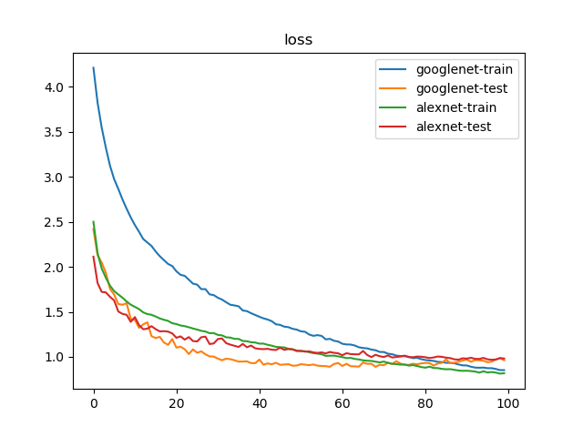
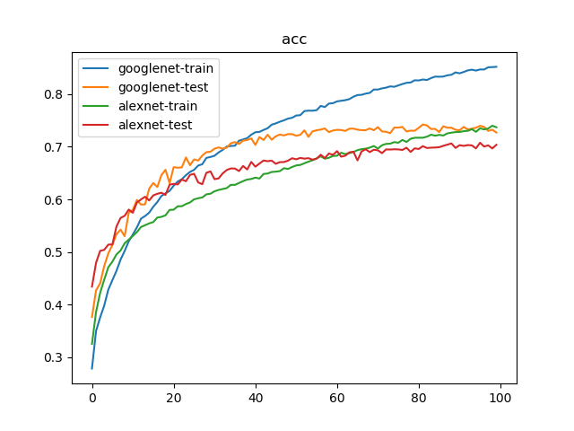

# GoogLeNet vs. AlexNet

## 训练参数

1. 数据集：`PASCAL VOC 07+12`，`20`类共`40058`个训练样本和`12032`个测试样本
2. 批量大小：`128`
3. 优化器：`Adam`，学习率为`1e-3`
4. 随步长衰减：每隔`4`轮衰减`10%`，学习因子为`0.9`
5. 迭代次数：`100`轮

## 训练日志





```
$ python classifier_googlenet.py 
{'train': <torch.utils.data.dataloader.DataLoader object at 0x7f241bdda250>, 'test': <torch.utils.data.dataloader.DataLoader object at 0x7f2414c004d0>}
{'train': 40058, 'test': 12032}
Epoch 0/99
----------
train Loss: 4.2119 Acc: 0.2785
test Loss: 2.4186 Acc: 0.3763
Epoch 1/99
----------
train Loss: 3.8248 Acc: 0.3500
test Loss: 2.1310 Acc: 0.4271
Epoch 2/99
----------
train Loss: 3.5462 Acc: 0.3756
test Loss: 2.0471 Acc: 0.4403
Epoch 3/99
----------
train Loss: 3.3232 Acc: 0.3982
test Loss: 1.9330 Acc: 0.4732
Epoch 4/99
----------
train Loss: 3.1231 Acc: 0.4285
test Loss: 1.7548 Acc: 0.4973
Epoch 5/99
----------
train Loss: 2.9739 Acc: 0.4465
test Loss: 1.6911 Acc: 0.5134
Epoch 6/99
----------
train Loss: 2.8656 Acc: 0.4642
test Loss: 1.5869 Acc: 0.5337
Epoch 7/99
----------
train Loss: 2.7492 Acc: 0.4855
test Loss: 1.5782 Acc: 0.5426
Epoch 8/99
----------
train Loss: 2.6458 Acc: 0.5019
test Loss: 1.5954 Acc: 0.5299
Epoch 9/99
----------
train Loss: 2.5494 Acc: 0.5203
test Loss: 1.4210 Acc: 0.5746
Epoch 10/99
----------
train Loss: 2.4635 Acc: 0.5332
test Loss: 1.4103 Acc: 0.5801
Epoch 11/99
----------
train Loss: 2.3893 Acc: 0.5467
test Loss: 1.3218 Acc: 0.5989
Epoch 12/99
----------
train Loss: 2.3091 Acc: 0.5634
test Loss: 1.3601 Acc: 0.5901
Epoch 13/99
----------
train Loss: 2.2704 Acc: 0.5683
test Loss: 1.3838 Acc: 0.5906
Epoch 14/99
----------
train Loss: 2.2320 Acc: 0.5747
test Loss: 1.2297 Acc: 0.6203
Epoch 15/99
----------
train Loss: 2.1704 Acc: 0.5859
test Loss: 1.2088 Acc: 0.6312
Epoch 16/99
----------
train Loss: 2.1181 Acc: 0.5950
test Loss: 1.2215 Acc: 0.6236
Epoch 17/99
----------
train Loss: 2.0744 Acc: 0.6064
test Loss: 1.1588 Acc: 0.6461
Epoch 18/99
----------
train Loss: 2.0318 Acc: 0.6115
test Loss: 1.1330 Acc: 0.6563
Epoch 19/99
----------
train Loss: 2.0087 Acc: 0.6161
test Loss: 1.1983 Acc: 0.6307
Epoch 20/99
----------
train Loss: 1.9501 Acc: 0.6259
test Loss: 1.1029 Acc: 0.6612
Epoch 21/99
----------
train Loss: 1.9113 Acc: 0.6340
test Loss: 1.1123 Acc: 0.6602
Epoch 22/99
----------
train Loss: 1.8996 Acc: 0.6382
test Loss: 1.0841 Acc: 0.6608
Epoch 23/99
----------
train Loss: 1.8571 Acc: 0.6460
test Loss: 1.0311 Acc: 0.6798
Epoch 24/99
----------
train Loss: 1.8131 Acc: 0.6522
test Loss: 1.0824 Acc: 0.6649
Epoch 25/99
----------
train Loss: 1.8021 Acc: 0.6562
test Loss: 1.0453 Acc: 0.6759
Epoch 26/99
----------
train Loss: 1.7518 Acc: 0.6642
test Loss: 1.0607 Acc: 0.6738
Epoch 27/99
----------
train Loss: 1.7525 Acc: 0.6668
test Loss: 1.0275 Acc: 0.6833
Epoch 28/99
----------
train Loss: 1.6941 Acc: 0.6788
test Loss: 1.0048 Acc: 0.6897
Epoch 29/99
----------
train Loss: 1.6857 Acc: 0.6806
test Loss: 1.0028 Acc: 0.6907
Epoch 30/99
----------
train Loss: 1.6562 Acc: 0.6829
test Loss: 0.9801 Acc: 0.6963
Epoch 31/99
----------
train Loss: 1.6359 Acc: 0.6893
test Loss: 0.9617 Acc: 0.6988
Epoch 32/99
----------
train Loss: 1.6061 Acc: 0.6941
test Loss: 0.9797 Acc: 0.6964
Epoch 33/99
----------
train Loss: 1.5786 Acc: 0.7005
test Loss: 0.9740 Acc: 0.6985
Epoch 34/99
----------
train Loss: 1.5709 Acc: 0.7015
test Loss: 0.9617 Acc: 0.7066
Epoch 35/99
----------
train Loss: 1.5613 Acc: 0.7020
test Loss: 0.9467 Acc: 0.7088
Epoch 36/99
----------
train Loss: 1.5147 Acc: 0.7116
test Loss: 0.9476 Acc: 0.7054
Epoch 37/99
----------
train Loss: 1.5077 Acc: 0.7139
test Loss: 0.9498 Acc: 0.7118
Epoch 38/99
----------
train Loss: 1.4847 Acc: 0.7164
test Loss: 0.9301 Acc: 0.7128
Epoch 39/99
----------
train Loss: 1.4648 Acc: 0.7230
test Loss: 0.9300 Acc: 0.7158
Epoch 40/99
----------
train Loss: 1.4452 Acc: 0.7276
test Loss: 0.9694 Acc: 0.7035
Epoch 41/99
----------
train Loss: 1.4273 Acc: 0.7283
test Loss: 0.9121 Acc: 0.7185
Epoch 42/99
----------
train Loss: 1.4143 Acc: 0.7320
test Loss: 0.9268 Acc: 0.7128
Epoch 43/99
----------
train Loss: 1.3954 Acc: 0.7352
test Loss: 0.9175 Acc: 0.7229
Epoch 44/99
----------
train Loss: 1.3611 Acc: 0.7420
test Loss: 0.9337 Acc: 0.7134
Epoch 45/99
----------
train Loss: 1.3550 Acc: 0.7445
test Loss: 0.9116 Acc: 0.7199
Epoch 46/99
----------
train Loss: 1.3354 Acc: 0.7477
test Loss: 0.9144 Acc: 0.7232
Epoch 47/99
----------
train Loss: 1.3294 Acc: 0.7503
test Loss: 0.9187 Acc: 0.7216
Epoch 48/99
----------
train Loss: 1.3113 Acc: 0.7536
test Loss: 0.9010 Acc: 0.7241
Epoch 49/99
----------
train Loss: 1.3026 Acc: 0.7551
test Loss: 0.9037 Acc: 0.7239
Epoch 50/99
----------
train Loss: 1.2834 Acc: 0.7595
test Loss: 0.9184 Acc: 0.7209
Epoch 51/99
----------
train Loss: 1.2784 Acc: 0.7600
test Loss: 0.9128 Acc: 0.7228
Epoch 52/99
----------
train Loss: 1.2479 Acc: 0.7678
test Loss: 0.9074 Acc: 0.7312
Epoch 53/99
----------
train Loss: 1.2332 Acc: 0.7687
test Loss: 0.9153 Acc: 0.7188
Epoch 54/99
----------
train Loss: 1.2410 Acc: 0.7685
test Loss: 0.9021 Acc: 0.7293
Epoch 55/99
----------
train Loss: 1.2326 Acc: 0.7696
test Loss: 0.8984 Acc: 0.7314
Epoch 56/99
----------
train Loss: 1.1937 Acc: 0.7777
test Loss: 0.8963 Acc: 0.7326
Epoch 57/99
----------
train Loss: 1.1996 Acc: 0.7755
test Loss: 0.8897 Acc: 0.7348
Epoch 58/99
----------
train Loss: 1.1784 Acc: 0.7821
test Loss: 0.9208 Acc: 0.7278
Epoch 59/99
----------
train Loss: 1.1699 Acc: 0.7829
test Loss: 0.9314 Acc: 0.7310
Epoch 60/99
----------
train Loss: 1.1449 Acc: 0.7863
test Loss: 0.8985 Acc: 0.7322
Epoch 61/99
----------
train Loss: 1.1375 Acc: 0.7874
test Loss: 0.9224 Acc: 0.7318
Epoch 62/99
----------
train Loss: 1.1364 Acc: 0.7886
test Loss: 0.8962 Acc: 0.7301
Epoch 63/99
----------
train Loss: 1.1257 Acc: 0.7906
test Loss: 0.8937 Acc: 0.7343
Epoch 64/99
----------
train Loss: 1.1062 Acc: 0.7951
test Loss: 0.8911 Acc: 0.7345
Epoch 65/99
----------
train Loss: 1.0981 Acc: 0.7982
test Loss: 0.9371 Acc: 0.7325
Epoch 66/99
----------
train Loss: 1.0940 Acc: 0.7987
test Loss: 0.9220 Acc: 0.7315
Epoch 67/99
----------
train Loss: 1.0802 Acc: 0.8010
test Loss: 0.9229 Acc: 0.7315
Epoch 68/99
----------
train Loss: 1.0733 Acc: 0.8024
test Loss: 0.8889 Acc: 0.7348
Epoch 69/99
----------
train Loss: 1.0541 Acc: 0.8089
test Loss: 0.9117 Acc: 0.7315
Epoch 70/99
----------
train Loss: 1.0535 Acc: 0.8088
test Loss: 0.9071 Acc: 0.7373
Epoch 71/99
----------
train Loss: 1.0345 Acc: 0.8110
test Loss: 0.9338 Acc: 0.7291
Epoch 72/99
----------
train Loss: 1.0288 Acc: 0.8124
test Loss: 0.9211 Acc: 0.7284
Epoch 73/99
----------
train Loss: 1.0137 Acc: 0.8148
test Loss: 0.9504 Acc: 0.7259
Epoch 74/99
----------
train Loss: 1.0090 Acc: 0.8140
test Loss: 0.9251 Acc: 0.7365
Epoch 75/99
----------
train Loss: 1.0075 Acc: 0.8166
test Loss: 0.9124 Acc: 0.7365
Epoch 76/99
----------
train Loss: 1.0011 Acc: 0.8193
test Loss: 0.9107 Acc: 0.7377
Epoch 77/99
----------
train Loss: 0.9853 Acc: 0.8215
test Loss: 0.9227 Acc: 0.7291
Epoch 78/99
----------
train Loss: 0.9893 Acc: 0.8222
test Loss: 0.9174 Acc: 0.7306
Epoch 79/99
----------
train Loss: 0.9744 Acc: 0.8264
test Loss: 0.9266 Acc: 0.7305
Epoch 80/99
----------
train Loss: 0.9646 Acc: 0.8261
test Loss: 0.9319 Acc: 0.7360
Epoch 81/99
----------
train Loss: 0.9594 Acc: 0.8279
test Loss: 0.9305 Acc: 0.7424
Epoch 82/99
----------
train Loss: 0.9547 Acc: 0.8269
test Loss: 0.9026 Acc: 0.7405
Epoch 83/99
----------
train Loss: 0.9438 Acc: 0.8305
test Loss: 0.9256 Acc: 0.7338
Epoch 84/99
----------
train Loss: 0.9412 Acc: 0.8333
test Loss: 0.9331 Acc: 0.7340
Epoch 85/99
----------
train Loss: 0.9338 Acc: 0.8331
test Loss: 0.9712 Acc: 0.7280
Epoch 86/99
----------
train Loss: 0.9332 Acc: 0.8335
test Loss: 0.9290 Acc: 0.7389
Epoch 87/99
----------
train Loss: 0.9281 Acc: 0.8358
test Loss: 0.9353 Acc: 0.7362
Epoch 88/99
----------
train Loss: 0.9152 Acc: 0.8369
test Loss: 0.9465 Acc: 0.7362
Epoch 89/99
----------
train Loss: 0.9052 Acc: 0.8414
test Loss: 0.9584 Acc: 0.7323
Epoch 90/99
----------
train Loss: 0.9042 Acc: 0.8396
test Loss: 0.9695 Acc: 0.7314
Epoch 91/99
----------
train Loss: 0.8901 Acc: 0.8422
test Loss: 0.9447 Acc: 0.7377
Epoch 92/99
----------
train Loss: 0.8804 Acc: 0.8452
test Loss: 0.9633 Acc: 0.7329
Epoch 93/99
----------
train Loss: 0.8789 Acc: 0.8465
test Loss: 0.9615 Acc: 0.7345
Epoch 94/99
----------
train Loss: 0.8804 Acc: 0.8448
test Loss: 0.9564 Acc: 0.7362
Epoch 95/99
----------
train Loss: 0.8739 Acc: 0.8469
test Loss: 0.9396 Acc: 0.7398
Epoch 96/99
----------
train Loss: 0.8737 Acc: 0.8468
test Loss: 0.9468 Acc: 0.7377
Epoch 97/99
----------
train Loss: 0.8651 Acc: 0.8511
test Loss: 0.9694 Acc: 0.7302
Epoch 98/99
----------
train Loss: 0.8523 Acc: 0.8514
test Loss: 0.9841 Acc: 0.7325
Epoch 99/99
----------
train Loss: 0.8524 Acc: 0.8520
test Loss: 0.9624 Acc: 0.7271
Training complete in 152m 21s
Best val Acc: 0.742354
train googlenet done

Epoch 0/99
----------
train Loss: 2.5005 Acc: 0.3253
test Loss: 2.1131 Acc: 0.4341
Epoch 1/99
----------
train Loss: 2.1525 Acc: 0.3861
test Loss: 1.8203 Acc: 0.4796
Epoch 2/99
----------
train Loss: 1.9808 Acc: 0.4223
test Loss: 1.7211 Acc: 0.5022
Epoch 3/99
----------
train Loss: 1.8781 Acc: 0.4475
test Loss: 1.7159 Acc: 0.5041
Epoch 4/99
----------
train Loss: 1.7902 Acc: 0.4710
test Loss: 1.6665 Acc: 0.5140
Epoch 5/99
----------
train Loss: 1.7303 Acc: 0.4817
test Loss: 1.6265 Acc: 0.5143
Epoch 6/99
----------
train Loss: 1.6928 Acc: 0.4954
test Loss: 1.5038 Acc: 0.5485
Epoch 7/99
----------
train Loss: 1.6573 Acc: 0.5028
test Loss: 1.4774 Acc: 0.5647
Epoch 8/99
----------
train Loss: 1.6150 Acc: 0.5165
test Loss: 1.4668 Acc: 0.5687
Epoch 9/99
----------
train Loss: 1.5792 Acc: 0.5235
test Loss: 1.3887 Acc: 0.5806
Epoch 10/99
----------
train Loss: 1.5552 Acc: 0.5305
test Loss: 1.4417 Acc: 0.5746
Epoch 11/99
----------
train Loss: 1.5299 Acc: 0.5377
test Loss: 1.3526 Acc: 0.5940
Epoch 12/99
----------
train Loss: 1.4939 Acc: 0.5474
test Loss: 1.3063 Acc: 0.5999
Epoch 13/99
----------
train Loss: 1.4749 Acc: 0.5509
test Loss: 1.3124 Acc: 0.6051
Epoch 14/99
----------
train Loss: 1.4670 Acc: 0.5543
test Loss: 1.3406 Acc: 0.5979
Epoch 15/99
----------
train Loss: 1.4483 Acc: 0.5568
test Loss: 1.3078 Acc: 0.6075
Epoch 16/99
----------
train Loss: 1.4263 Acc: 0.5655
test Loss: 1.2825 Acc: 0.6106
Epoch 17/99
----------
train Loss: 1.4116 Acc: 0.5668
test Loss: 1.2851 Acc: 0.6125
Epoch 18/99
----------
train Loss: 1.3992 Acc: 0.5696
test Loss: 1.2800 Acc: 0.6085
Epoch 19/99
----------
train Loss: 1.3732 Acc: 0.5800
test Loss: 1.2601 Acc: 0.6279
Epoch 20/99
----------
train Loss: 1.3640 Acc: 0.5804
test Loss: 1.2114 Acc: 0.6295
Epoch 21/99
----------
train Loss: 1.3484 Acc: 0.5869
test Loss: 1.2276 Acc: 0.6284
Epoch 22/99
----------
train Loss: 1.3408 Acc: 0.5870
test Loss: 1.1911 Acc: 0.6378
Epoch 23/99
----------
train Loss: 1.3288 Acc: 0.5911
test Loss: 1.2193 Acc: 0.6345
Epoch 24/99
----------
train Loss: 1.3145 Acc: 0.5942
test Loss: 1.1754 Acc: 0.6464
Epoch 25/99
----------
train Loss: 1.3028 Acc: 0.6000
test Loss: 1.1707 Acc: 0.6487
Epoch 26/99
----------
train Loss: 1.2886 Acc: 0.6021
test Loss: 1.2179 Acc: 0.6322
Epoch 27/99
----------
train Loss: 1.2810 Acc: 0.6036
test Loss: 1.2246 Acc: 0.6288
Epoch 28/99
----------
train Loss: 1.2626 Acc: 0.6096
test Loss: 1.1423 Acc: 0.6505
Epoch 29/99
----------
train Loss: 1.2639 Acc: 0.6107
test Loss: 1.1485 Acc: 0.6532
Epoch 30/99
----------
train Loss: 1.2435 Acc: 0.6154
test Loss: 1.1978 Acc: 0.6384
Epoch 31/99
----------
train Loss: 1.2382 Acc: 0.6179
test Loss: 1.2037 Acc: 0.6399
Epoch 32/99
----------
train Loss: 1.2170 Acc: 0.6197
test Loss: 1.1522 Acc: 0.6494
Epoch 33/99
----------
train Loss: 1.2136 Acc: 0.6214
test Loss: 1.1351 Acc: 0.6558
Epoch 34/99
----------
train Loss: 1.1998 Acc: 0.6277
test Loss: 1.1225 Acc: 0.6588
Epoch 35/99
----------
train Loss: 1.1992 Acc: 0.6276
test Loss: 1.1096 Acc: 0.6586
Epoch 36/99
----------
train Loss: 1.1759 Acc: 0.6313
test Loss: 1.1436 Acc: 0.6538
Epoch 37/99
----------
train Loss: 1.1735 Acc: 0.6347
test Loss: 1.1062 Acc: 0.6635
Epoch 38/99
----------
train Loss: 1.1617 Acc: 0.6377
test Loss: 1.1252 Acc: 0.6568
Epoch 39/99
----------
train Loss: 1.1590 Acc: 0.6388
test Loss: 1.0947 Acc: 0.6711
Epoch 40/99
----------
train Loss: 1.1465 Acc: 0.6413
test Loss: 1.0877 Acc: 0.6622
Epoch 41/99
----------
train Loss: 1.1468 Acc: 0.6396
test Loss: 1.0857 Acc: 0.6681
Epoch 42/99
----------
train Loss: 1.1337 Acc: 0.6483
test Loss: 1.0889 Acc: 0.6739
Epoch 43/99
----------
train Loss: 1.1236 Acc: 0.6491
test Loss: 1.0791 Acc: 0.6725
Epoch 44/99
----------
train Loss: 1.1108 Acc: 0.6521
test Loss: 1.0760 Acc: 0.6736
Epoch 45/99
----------
train Loss: 1.1068 Acc: 0.6527
test Loss: 1.1012 Acc: 0.6676
Epoch 46/99
----------
train Loss: 1.1048 Acc: 0.6537
test Loss: 1.0772 Acc: 0.6708
Epoch 47/99
----------
train Loss: 1.0888 Acc: 0.6593
test Loss: 1.0868 Acc: 0.6710
Epoch 48/99
----------
train Loss: 1.0824 Acc: 0.6578
test Loss: 1.0842 Acc: 0.6736
Epoch 49/99
----------
train Loss: 1.0701 Acc: 0.6616
test Loss: 1.0644 Acc: 0.6782
Epoch 50/99
----------
train Loss: 1.0649 Acc: 0.6645
test Loss: 1.0653 Acc: 0.6762
Epoch 51/99
----------
train Loss: 1.0623 Acc: 0.6655
test Loss: 1.0577 Acc: 0.6788
Epoch 52/99
----------
train Loss: 1.0508 Acc: 0.6686
test Loss: 1.0610 Acc: 0.6774
Epoch 53/99
----------
train Loss: 1.0417 Acc: 0.6717
test Loss: 1.0494 Acc: 0.6783
Epoch 54/99
----------
train Loss: 1.0358 Acc: 0.6744
test Loss: 1.0432 Acc: 0.6755
Epoch 55/99
----------
train Loss: 1.0285 Acc: 0.6777
test Loss: 1.0490 Acc: 0.6774
Epoch 56/99
----------
train Loss: 1.0107 Acc: 0.6820
test Loss: 1.0383 Acc: 0.6848
Epoch 57/99
----------
train Loss: 1.0126 Acc: 0.6774
test Loss: 1.0540 Acc: 0.6785
Epoch 58/99
----------
train Loss: 1.0130 Acc: 0.6790
test Loss: 1.0442 Acc: 0.6872
Epoch 59/99
----------
train Loss: 1.0049 Acc: 0.6826
test Loss: 1.0388 Acc: 0.6847
Epoch 60/99
----------
train Loss: 0.9966 Acc: 0.6829
test Loss: 1.0179 Acc: 0.6917
Epoch 61/99
----------
train Loss: 0.9859 Acc: 0.6886
test Loss: 1.0404 Acc: 0.6812
Epoch 62/99
----------
train Loss: 0.9880 Acc: 0.6860
test Loss: 1.0307 Acc: 0.6829
Epoch 63/99
----------
train Loss: 0.9768 Acc: 0.6880
test Loss: 1.0278 Acc: 0.6893
Epoch 64/99
----------
train Loss: 0.9705 Acc: 0.6900
test Loss: 1.0275 Acc: 0.6907
Epoch 65/99
----------
train Loss: 0.9612 Acc: 0.6936
test Loss: 1.0647 Acc: 0.6741
Epoch 66/99
----------
train Loss: 0.9564 Acc: 0.6954
test Loss: 1.0203 Acc: 0.6911
Epoch 67/99
----------
train Loss: 0.9546 Acc: 0.6964
test Loss: 0.9972 Acc: 0.6952
Epoch 68/99
----------
train Loss: 0.9462 Acc: 0.6984
test Loss: 1.0225 Acc: 0.6898
Epoch 69/99
----------
train Loss: 0.9381 Acc: 0.7014
test Loss: 1.0069 Acc: 0.6943
Epoch 70/99
----------
train Loss: 0.9473 Acc: 0.6966
test Loss: 0.9978 Acc: 0.6933
Epoch 71/99
----------
train Loss: 0.9328 Acc: 0.7029
test Loss: 1.0155 Acc: 0.6878
Epoch 72/99
----------
train Loss: 0.9220 Acc: 0.7055
test Loss: 0.9927 Acc: 0.6950
Epoch 73/99
----------
train Loss: 0.9191 Acc: 0.7058
test Loss: 0.9980 Acc: 0.6947
Epoch 74/99
----------
train Loss: 0.9131 Acc: 0.7089
test Loss: 1.0034 Acc: 0.6952
Epoch 75/99
----------
train Loss: 0.9139 Acc: 0.7076
test Loss: 1.0136 Acc: 0.6950
Epoch 76/99
----------
train Loss: 0.9027 Acc: 0.7130
test Loss: 0.9960 Acc: 0.6940
Epoch 77/99
----------
train Loss: 0.9076 Acc: 0.7091
test Loss: 0.9954 Acc: 0.6982
Epoch 78/99
----------
train Loss: 0.8982 Acc: 0.7152
test Loss: 1.0030 Acc: 0.6902
Epoch 79/99
----------
train Loss: 0.8867 Acc: 0.7171
test Loss: 1.0010 Acc: 0.6970
Epoch 80/99
----------
train Loss: 0.8793 Acc: 0.7172
test Loss: 0.9957 Acc: 0.6958
Epoch 81/99
----------
train Loss: 0.8909 Acc: 0.7172
test Loss: 0.9861 Acc: 0.7011
Epoch 82/99
----------
train Loss: 0.8762 Acc: 0.7192
test Loss: 0.9931 Acc: 0.6976
Epoch 83/99
----------
train Loss: 0.8746 Acc: 0.7230
test Loss: 1.0036 Acc: 0.6983
Epoch 84/99
----------
train Loss: 0.8661 Acc: 0.7211
test Loss: 0.9997 Acc: 0.6986
Epoch 85/99
----------
train Loss: 0.8615 Acc: 0.7226
test Loss: 0.9909 Acc: 0.6991
Epoch 86/99
----------
train Loss: 0.8631 Acc: 0.7213
test Loss: 0.9859 Acc: 0.7018
Epoch 87/99
----------
train Loss: 0.8554 Acc: 0.7254
test Loss: 0.9720 Acc: 0.7040
Epoch 88/99
----------
train Loss: 0.8479 Acc: 0.7268
test Loss: 0.9685 Acc: 0.7063
Epoch 89/99
----------
train Loss: 0.8442 Acc: 0.7279
test Loss: 0.9837 Acc: 0.6978
Epoch 90/99
----------
train Loss: 0.8456 Acc: 0.7282
test Loss: 0.9800 Acc: 0.7030
Epoch 91/99
----------
train Loss: 0.8418 Acc: 0.7296
test Loss: 0.9896 Acc: 0.7016
Epoch 92/99
----------
train Loss: 0.8366 Acc: 0.7303
test Loss: 0.9774 Acc: 0.7032
Epoch 93/99
----------
train Loss: 0.8244 Acc: 0.7334
test Loss: 0.9764 Acc: 0.7026
Epoch 94/99
----------
train Loss: 0.8393 Acc: 0.7284
test Loss: 0.9879 Acc: 0.6970
Epoch 95/99
----------
train Loss: 0.8261 Acc: 0.7350
test Loss: 0.9722 Acc: 0.7076
Epoch 96/99
----------
train Loss: 0.8313 Acc: 0.7330
test Loss: 0.9673 Acc: 0.7004
Epoch 97/99
----------
train Loss: 0.8249 Acc: 0.7347
test Loss: 0.9704 Acc: 0.7027
Epoch 98/99
----------
train Loss: 0.8132 Acc: 0.7400
test Loss: 0.9865 Acc: 0.6968
Epoch 99/99
----------
train Loss: 0.8181 Acc: 0.7370
test Loss: 0.9812 Acc: 0.7037
Training complete in 62m 33s
Best val Acc: 0.707613
train alexnet done
```
