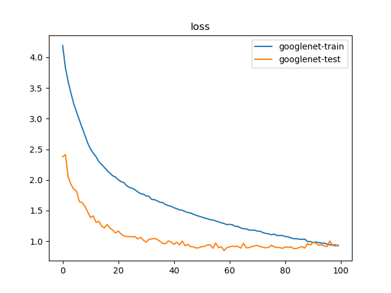
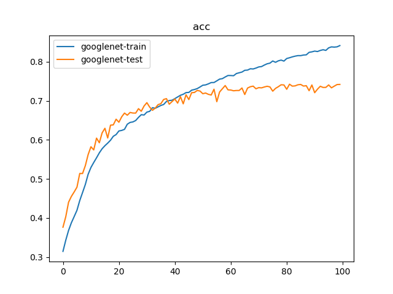

# GoogLeNet

## 训练参数

1. 数据集：`PASCAL VOC 07+12`，`20`类共`40058`个训练样本和`12032`个测试样本
2. 批量大小：`128`
3. 优化器：`Adam`，学习率为`1e-3`
4. 随步长衰减：每隔`8`轮衰减`4%`，学习因子为`0.96`
5. 迭代次数：`100`轮

## 训练日志





```
$ python classifier_googlenet.py 
{'train': <torch.utils.data.dataloader.DataLoader object at 0x7f89f893a510>, 'test': <torch.utils.data.dataloader.DataLoader object at 0x7f89f8568190>}
{'train': 40058, 'test': 12032}
Epoch 0/99
----------
train Loss: 4.1952 Acc: 0.3144
test Loss: 2.3778 Acc: 0.3763
Epoch 1/99
----------
train Loss: 3.8275 Acc: 0.3430
test Loss: 2.4141 Acc: 0.4031
Epoch 2/99
----------
train Loss: 3.6014 Acc: 0.3680
test Loss: 2.0443 Acc: 0.4402
Epoch 3/99
----------
train Loss: 3.4145 Acc: 0.3876
test Loss: 1.9260 Acc: 0.4551
Epoch 4/99
----------
train Loss: 3.2416 Acc: 0.4034
test Loss: 1.8496 Acc: 0.4666
Epoch 5/99
----------
train Loss: 3.1070 Acc: 0.4196
test Loss: 1.8147 Acc: 0.4788
Epoch 6/99
----------
train Loss: 2.9794 Acc: 0.4446
test Loss: 1.6450 Acc: 0.5140
Epoch 7/99
----------
train Loss: 2.8511 Acc: 0.4650
test Loss: 1.6310 Acc: 0.5138
Epoch 8/99
----------
train Loss: 2.7288 Acc: 0.4858
test Loss: 1.5708 Acc: 0.5341
Epoch 9/99
----------
train Loss: 2.6022 Acc: 0.5119
test Loss: 1.4786 Acc: 0.5623
Epoch 10/99
----------
train Loss: 2.5066 Acc: 0.5293
test Loss: 1.3870 Acc: 0.5824
Epoch 11/99
----------
train Loss: 2.4371 Acc: 0.5420
test Loss: 1.4140 Acc: 0.5743
Epoch 12/99
----------
train Loss: 2.3788 Acc: 0.5541
test Loss: 1.3064 Acc: 0.6045
Epoch 13/99
----------
train Loss: 2.2996 Acc: 0.5667
test Loss: 1.3257 Acc: 0.5926
Epoch 14/99
----------
train Loss: 2.2520 Acc: 0.5773
test Loss: 1.2484 Acc: 0.6179
Epoch 15/99
----------
train Loss: 2.2047 Acc: 0.5851
test Loss: 1.2161 Acc: 0.6297
Epoch 16/99
----------
train Loss: 2.1514 Acc: 0.5917
test Loss: 1.2719 Acc: 0.6048
Epoch 17/99
----------
train Loss: 2.1096 Acc: 0.5991
test Loss: 1.2131 Acc: 0.6376
Epoch 18/99
----------
train Loss: 2.0684 Acc: 0.6092
test Loss: 1.1805 Acc: 0.6385
Epoch 19/99
----------
train Loss: 2.0465 Acc: 0.6136
test Loss: 1.1353 Acc: 0.6529
Epoch 20/99
----------
train Loss: 2.0030 Acc: 0.6228
test Loss: 1.1652 Acc: 0.6452
Epoch 21/99
----------
train Loss: 1.9716 Acc: 0.6242
test Loss: 1.1179 Acc: 0.6591
Epoch 22/99
----------
train Loss: 1.9577 Acc: 0.6269
test Loss: 1.0868 Acc: 0.6686
Epoch 23/99
----------
train Loss: 1.9050 Acc: 0.6401
test Loss: 1.0750 Acc: 0.6631
Epoch 24/99
----------
train Loss: 1.8778 Acc: 0.6447
test Loss: 1.0763 Acc: 0.6702
Epoch 25/99
----------
train Loss: 1.8647 Acc: 0.6460
test Loss: 1.0716 Acc: 0.6687
Epoch 26/99
----------
train Loss: 1.8399 Acc: 0.6496
test Loss: 1.0758 Acc: 0.6686
Epoch 27/99
----------
train Loss: 1.8050 Acc: 0.6576
test Loss: 1.0372 Acc: 0.6799
Epoch 28/99
----------
train Loss: 1.7763 Acc: 0.6645
test Loss: 1.0623 Acc: 0.6733
Epoch 29/99
----------
train Loss: 1.7679 Acc: 0.6637
test Loss: 1.0184 Acc: 0.6868
Epoch 30/99
----------
train Loss: 1.7393 Acc: 0.6711
test Loss: 0.9834 Acc: 0.6953
Epoch 31/99
----------
train Loss: 1.7330 Acc: 0.6730
test Loss: 1.0295 Acc: 0.6839
Epoch 32/99
----------
train Loss: 1.6809 Acc: 0.6823
test Loss: 1.0378 Acc: 0.6757
Epoch 33/99
----------
train Loss: 1.6777 Acc: 0.6809
test Loss: 1.0445 Acc: 0.6814
Epoch 34/99
----------
train Loss: 1.6591 Acc: 0.6845
test Loss: 1.0287 Acc: 0.6902
Epoch 35/99
----------
train Loss: 1.6350 Acc: 0.6882
test Loss: 0.9989 Acc: 0.6927
Epoch 36/99
----------
train Loss: 1.6309 Acc: 0.6906
test Loss: 0.9637 Acc: 0.7035
Epoch 37/99
----------
train Loss: 1.5977 Acc: 0.6983
test Loss: 0.9594 Acc: 0.7056
Epoch 38/99
----------
train Loss: 1.5816 Acc: 0.7007
test Loss: 1.0058 Acc: 0.6913
Epoch 39/99
----------
train Loss: 1.5710 Acc: 0.7015
test Loss: 0.9859 Acc: 0.6981
Epoch 40/99
----------
train Loss: 1.5460 Acc: 0.7056
test Loss: 0.9507 Acc: 0.7046
Epoch 41/99
----------
train Loss: 1.5311 Acc: 0.7099
test Loss: 0.9841 Acc: 0.6941
Epoch 42/99
----------
train Loss: 1.5104 Acc: 0.7142
test Loss: 0.9404 Acc: 0.7108
Epoch 43/99
----------
train Loss: 1.5056 Acc: 0.7168
test Loss: 1.0023 Acc: 0.6923
Epoch 44/99
----------
train Loss: 1.4843 Acc: 0.7211
test Loss: 0.9257 Acc: 0.7154
Epoch 45/99
----------
train Loss: 1.4671 Acc: 0.7216
test Loss: 0.9473 Acc: 0.7032
Epoch 46/99
----------
train Loss: 1.4607 Acc: 0.7273
test Loss: 0.9117 Acc: 0.7208
Epoch 47/99
----------
train Loss: 1.4402 Acc: 0.7290
test Loss: 0.9071 Acc: 0.7214
Epoch 48/99
----------
train Loss: 1.4236 Acc: 0.7313
test Loss: 0.8884 Acc: 0.7266
Epoch 49/99
----------
train Loss: 1.4067 Acc: 0.7355
test Loss: 0.8941 Acc: 0.7251
Epoch 50/99
----------
train Loss: 1.3949 Acc: 0.7400
test Loss: 0.9114 Acc: 0.7183
Epoch 51/99
----------
train Loss: 1.3762 Acc: 0.7408
test Loss: 0.9163 Acc: 0.7200
Epoch 52/99
----------
train Loss: 1.3681 Acc: 0.7435
test Loss: 0.9389 Acc: 0.7166
Epoch 53/99
----------
train Loss: 1.3508 Acc: 0.7468
test Loss: 0.9417 Acc: 0.7149
Epoch 54/99
----------
train Loss: 1.3475 Acc: 0.7469
test Loss: 0.8848 Acc: 0.7298
Epoch 55/99
----------
train Loss: 1.3317 Acc: 0.7512
test Loss: 0.9716 Acc: 0.6978
Epoch 56/99
----------
train Loss: 1.3145 Acc: 0.7556
test Loss: 0.8943 Acc: 0.7227
Epoch 57/99
----------
train Loss: 1.3013 Acc: 0.7569
test Loss: 0.9125 Acc: 0.7309
Epoch 58/99
----------
train Loss: 1.2887 Acc: 0.7611
test Loss: 0.8482 Acc: 0.7392
Epoch 59/99
----------
train Loss: 1.2710 Acc: 0.7648
test Loss: 0.8948 Acc: 0.7281
Epoch 60/99
----------
train Loss: 1.2756 Acc: 0.7648
test Loss: 0.9090 Acc: 0.7276
Epoch 61/99
----------
train Loss: 1.2686 Acc: 0.7643
test Loss: 0.9199 Acc: 0.7257
Epoch 62/99
----------
train Loss: 1.2433 Acc: 0.7699
test Loss: 0.9124 Acc: 0.7265
Epoch 63/99
----------
train Loss: 1.2405 Acc: 0.7718
test Loss: 0.9171 Acc: 0.7265
Epoch 64/99
----------
train Loss: 1.2166 Acc: 0.7737
test Loss: 0.8867 Acc: 0.7329
Epoch 65/99
----------
train Loss: 1.2043 Acc: 0.7782
test Loss: 0.9646 Acc: 0.7162
Epoch 66/99
----------
train Loss: 1.2011 Acc: 0.7787
test Loss: 0.8917 Acc: 0.7327
Epoch 67/99
----------
train Loss: 1.1816 Acc: 0.7821
test Loss: 0.8975 Acc: 0.7361
Epoch 68/99
----------
train Loss: 1.1802 Acc: 0.7816
test Loss: 0.9114 Acc: 0.7376
Epoch 69/99
----------
train Loss: 1.1798 Acc: 0.7839
test Loss: 0.9253 Acc: 0.7309
Epoch 70/99
----------
train Loss: 1.1641 Acc: 0.7868
test Loss: 0.9308 Acc: 0.7338
Epoch 71/99
----------
train Loss: 1.1635 Acc: 0.7877
test Loss: 0.9131 Acc: 0.7332
Epoch 72/99
----------
train Loss: 1.1394 Acc: 0.7916
test Loss: 0.9008 Acc: 0.7355
Epoch 73/99
----------
train Loss: 1.1273 Acc: 0.7949
test Loss: 0.8930 Acc: 0.7373
Epoch 74/99
----------
train Loss: 1.1211 Acc: 0.7965
test Loss: 0.8978 Acc: 0.7356
Epoch 75/99
----------
train Loss: 1.1046 Acc: 0.8020
test Loss: 0.9344 Acc: 0.7247
Epoch 76/99
----------
train Loss: 1.1170 Acc: 0.7987
test Loss: 0.9088 Acc: 0.7319
Epoch 77/99
----------
train Loss: 1.0929 Acc: 0.8024
test Loss: 0.8987 Acc: 0.7362
Epoch 78/99
----------
train Loss: 1.0934 Acc: 0.8043
test Loss: 0.8964 Acc: 0.7411
Epoch 79/99
----------
train Loss: 1.0929 Acc: 0.8017
test Loss: 0.8825 Acc: 0.7407
Epoch 80/99
----------
train Loss: 1.0767 Acc: 0.8084
test Loss: 0.9080 Acc: 0.7296
Epoch 81/99
----------
train Loss: 1.0713 Acc: 0.8103
test Loss: 0.9007 Acc: 0.7426
Epoch 82/99
----------
train Loss: 1.0556 Acc: 0.8126
test Loss: 0.9068 Acc: 0.7376
Epoch 83/99
----------
train Loss: 1.0413 Acc: 0.8144
test Loss: 0.8814 Acc: 0.7383
Epoch 84/99
----------
train Loss: 1.0402 Acc: 0.8158
test Loss: 0.8821 Acc: 0.7411
Epoch 85/99
----------
train Loss: 1.0336 Acc: 0.8157
test Loss: 0.8955 Acc: 0.7419
Epoch 86/99
----------
train Loss: 1.0294 Acc: 0.8173
test Loss: 0.9134 Acc: 0.7378
Epoch 87/99
----------
train Loss: 1.0352 Acc: 0.8178
test Loss: 0.8869 Acc: 0.7388
Epoch 88/99
----------
train Loss: 0.9958 Acc: 0.8242
test Loss: 0.9611 Acc: 0.7260
Epoch 89/99
----------
train Loss: 0.9949 Acc: 0.8255
test Loss: 0.9358 Acc: 0.7406
Epoch 90/99
----------
train Loss: 0.9795 Acc: 0.8274
test Loss: 0.9806 Acc: 0.7208
Epoch 91/99
----------
train Loss: 0.9874 Acc: 0.8263
test Loss: 0.9674 Acc: 0.7299
Epoch 92/99
----------
train Loss: 0.9777 Acc: 0.8290
test Loss: 0.9349 Acc: 0.7373
Epoch 93/99
----------
train Loss: 0.9681 Acc: 0.8309
test Loss: 0.9424 Acc: 0.7343
Epoch 94/99
----------
train Loss: 0.9695 Acc: 0.8292
test Loss: 0.9240 Acc: 0.7345
Epoch 95/99
----------
train Loss: 0.9530 Acc: 0.8357
test Loss: 0.9126 Acc: 0.7407
Epoch 96/99
----------
train Loss: 0.9422 Acc: 0.8382
test Loss: 1.0039 Acc: 0.7333
Epoch 97/99
----------
train Loss: 0.9364 Acc: 0.8376
test Loss: 0.9345 Acc: 0.7376
Epoch 98/99
----------
train Loss: 0.9406 Acc: 0.8383
test Loss: 0.9211 Acc: 0.7417
Epoch 99/99
----------
train Loss: 0.9241 Acc: 0.8415
test Loss: 0.9402 Acc: 0.7420
Training complete in 152m 46s
Best val Acc: 0.742603
train googlenet done
```