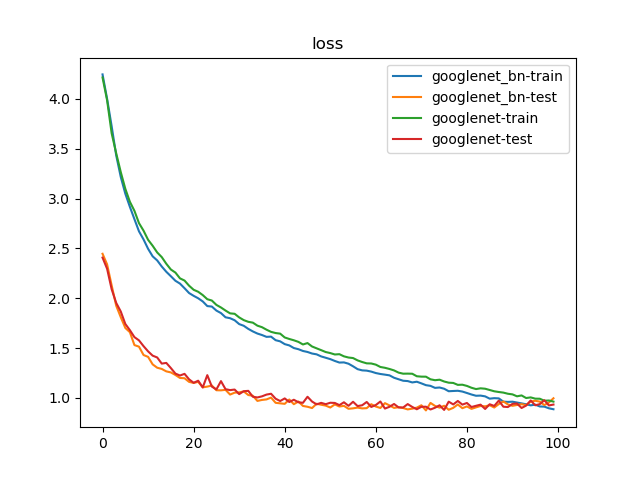
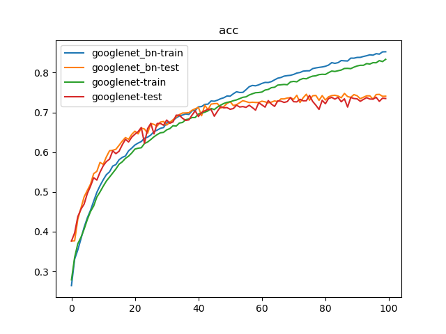

# GoogLeNet_BN vs. GoogLeNet

## 训练参数

1. 数据集：`PASCAL VOC 07+12`，`20`类共`40058`个训练样本和`12032`个测试样本
2. 批量大小：`128`
3. 优化器：`Adam`，学习率为`1e-3`
4. 随步长衰减：每隔`8`轮衰减`4%`，学习因子为`0.96`
5. 迭代次数：`100`轮

## 训练日志





```
$ python classifier_googlenet_bn.py 
{'train': <torch.utils.data.dataloader.DataLoader object at 0x7f84a32c7250>, 'test': <torch.utils.data.dataloader.DataLoader object at 0x7f84a32c7810>}
{'train': 40058, 'test': 12032}
Epoch 0/99
----------
train Loss: 4.2452 Acc: 0.2644
test Loss: 2.4459 Acc: 0.3763
Epoch 1/99
----------
train Loss: 3.9999 Acc: 0.3308
test Loss: 2.3396 Acc: 0.3769
Epoch 2/99
----------
train Loss: 3.7250 Acc: 0.3540
test Loss: 2.1286 Acc: 0.4314
Epoch 3/99
----------
train Loss: 3.4330 Acc: 0.3821
test Loss: 1.9250 Acc: 0.4595
Epoch 4/99
----------
train Loss: 3.2167 Acc: 0.4114
test Loss: 1.8100 Acc: 0.4878
Epoch 5/99
----------
train Loss: 3.0487 Acc: 0.4348
test Loss: 1.7021 Acc: 0.5038
Epoch 6/99
----------
train Loss: 2.9171 Acc: 0.4537
test Loss: 1.6596 Acc: 0.5195
Epoch 7/99
----------
train Loss: 2.7934 Acc: 0.4767
test Loss: 1.5303 Acc: 0.5460
Epoch 8/99
----------
train Loss: 2.6712 Acc: 0.4990
test Loss: 1.5144 Acc: 0.5518
Epoch 9/99
----------
train Loss: 2.5900 Acc: 0.5158
test Loss: 1.4306 Acc: 0.5743
Epoch 10/99
----------
train Loss: 2.4959 Acc: 0.5305
test Loss: 1.4120 Acc: 0.5693
Epoch 11/99
----------
train Loss: 2.4205 Acc: 0.5435
test Loss: 1.3369 Acc: 0.5882
Epoch 12/99
----------
train Loss: 2.3793 Acc: 0.5507
test Loss: 1.3033 Acc: 0.6036
Epoch 13/99
----------
train Loss: 2.3183 Acc: 0.5651
test Loss: 1.2910 Acc: 0.6048
Epoch 14/99
----------
train Loss: 2.2653 Acc: 0.5688
test Loss: 1.2665 Acc: 0.6073
Epoch 15/99
----------
train Loss: 2.2209 Acc: 0.5810
test Loss: 1.2562 Acc: 0.6173
Epoch 16/99
----------
train Loss: 2.1752 Acc: 0.5868
test Loss: 1.2303 Acc: 0.6277
Epoch 17/99
----------
train Loss: 2.1469 Acc: 0.5904
test Loss: 1.2004 Acc: 0.6368
Epoch 18/99
----------
train Loss: 2.1007 Acc: 0.6034
test Loss: 1.1978 Acc: 0.6326
Epoch 19/99
----------
train Loss: 2.0522 Acc: 0.6103
test Loss: 1.1613 Acc: 0.6447
Epoch 20/99
----------
train Loss: 2.0243 Acc: 0.6181
test Loss: 1.1506 Acc: 0.6528
Epoch 21/99
----------
train Loss: 1.9996 Acc: 0.6229
test Loss: 1.1613 Acc: 0.6460
Epoch 22/99
----------
train Loss: 1.9680 Acc: 0.6267
test Loss: 1.1064 Acc: 0.6606
Epoch 23/99
----------
train Loss: 1.9215 Acc: 0.6350
test Loss: 1.1139 Acc: 0.6583
Epoch 24/99
----------
train Loss: 1.9165 Acc: 0.6378
test Loss: 1.1245 Acc: 0.6477
Epoch 25/99
----------
train Loss: 1.8762 Acc: 0.6432
test Loss: 1.0773 Acc: 0.6722
Epoch 26/99
----------
train Loss: 1.8512 Acc: 0.6516
test Loss: 1.0764 Acc: 0.6699
Epoch 27/99
----------
train Loss: 1.8090 Acc: 0.6555
test Loss: 1.0814 Acc: 0.6656
Epoch 28/99
----------
train Loss: 1.7998 Acc: 0.6599
test Loss: 1.0340 Acc: 0.6758
Epoch 29/99
----------
train Loss: 1.7794 Acc: 0.6620
test Loss: 1.0531 Acc: 0.6772
Epoch 30/99
----------
train Loss: 1.7409 Acc: 0.6734
test Loss: 1.0559 Acc: 0.6681
Epoch 31/99
----------
train Loss: 1.7238 Acc: 0.6756
test Loss: 1.0655 Acc: 0.6748
Epoch 32/99
----------
train Loss: 1.6927 Acc: 0.6803
test Loss: 1.0293 Acc: 0.6817
Epoch 33/99
----------
train Loss: 1.6673 Acc: 0.6862
test Loss: 1.0220 Acc: 0.6887
Epoch 34/99
----------
train Loss: 1.6460 Acc: 0.6912
test Loss: 0.9703 Acc: 0.6946
Epoch 35/99
----------
train Loss: 1.6313 Acc: 0.6935
test Loss: 0.9801 Acc: 0.6986
Epoch 36/99
----------
train Loss: 1.6128 Acc: 0.6962
test Loss: 0.9854 Acc: 0.6987
Epoch 37/99
----------
train Loss: 1.6149 Acc: 0.6949
test Loss: 1.0036 Acc: 0.6994
Epoch 38/99
----------
train Loss: 1.5794 Acc: 0.7041
test Loss: 0.9511 Acc: 0.7055
Epoch 39/99
----------
train Loss: 1.5677 Acc: 0.7050
test Loss: 0.9461 Acc: 0.7093
Epoch 40/99
----------
train Loss: 1.5399 Acc: 0.7140
test Loss: 0.9409 Acc: 0.7127
Epoch 41/99
----------
train Loss: 1.5270 Acc: 0.7148
test Loss: 0.9846 Acc: 0.6917
Epoch 42/99
----------
train Loss: 1.5006 Acc: 0.7203
test Loss: 0.9374 Acc: 0.7182
Epoch 43/99
----------
train Loss: 1.4891 Acc: 0.7208
test Loss: 0.9645 Acc: 0.7068
Epoch 44/99
----------
train Loss: 1.4712 Acc: 0.7289
test Loss: 0.9198 Acc: 0.7209
Epoch 45/99
----------
train Loss: 1.4612 Acc: 0.7282
test Loss: 0.9117 Acc: 0.7221
Epoch 46/99
----------
train Loss: 1.4455 Acc: 0.7308
test Loss: 0.8989 Acc: 0.7225
Epoch 47/99
----------
train Loss: 1.4374 Acc: 0.7345
test Loss: 0.9417 Acc: 0.7109
Epoch 48/99
----------
train Loss: 1.4165 Acc: 0.7370
test Loss: 0.9320 Acc: 0.7147
Epoch 49/99
----------
train Loss: 1.4031 Acc: 0.7413
test Loss: 0.9232 Acc: 0.7224
Epoch 50/99
----------
train Loss: 1.3895 Acc: 0.7409
test Loss: 0.9040 Acc: 0.7270
Epoch 51/99
----------
train Loss: 1.3711 Acc: 0.7469
test Loss: 0.9353 Acc: 0.7173
Epoch 52/99
----------
train Loss: 1.3550 Acc: 0.7520
test Loss: 0.9142 Acc: 0.7195
Epoch 53/99
----------
train Loss: 1.3565 Acc: 0.7502
test Loss: 0.9207 Acc: 0.7245
Epoch 54/99
----------
train Loss: 1.3435 Acc: 0.7504
test Loss: 0.8914 Acc: 0.7296
Epoch 55/99
----------
train Loss: 1.3176 Acc: 0.7572
test Loss: 0.8958 Acc: 0.7273
Epoch 56/99
----------
train Loss: 1.2888 Acc: 0.7647
test Loss: 0.9033 Acc: 0.7248
Epoch 57/99
----------
train Loss: 1.2768 Acc: 0.7679
test Loss: 0.8952 Acc: 0.7256
Epoch 58/99
----------
train Loss: 1.2739 Acc: 0.7670
test Loss: 0.8977 Acc: 0.7251
Epoch 59/99
----------
train Loss: 1.2642 Acc: 0.7694
test Loss: 0.9373 Acc: 0.7249
Epoch 60/99
----------
train Loss: 1.2498 Acc: 0.7730
test Loss: 0.9139 Acc: 0.7283
Epoch 61/99
----------
train Loss: 1.2404 Acc: 0.7755
test Loss: 0.8995 Acc: 0.7266
Epoch 62/99
----------
train Loss: 1.2338 Acc: 0.7753
test Loss: 0.9479 Acc: 0.7242
Epoch 63/99
----------
train Loss: 1.2267 Acc: 0.7776
test Loss: 0.9252 Acc: 0.7260
Epoch 64/99
----------
train Loss: 1.2026 Acc: 0.7820
test Loss: 0.9004 Acc: 0.7290
Epoch 65/99
----------
train Loss: 1.1875 Acc: 0.7862
test Loss: 0.9070 Acc: 0.7272
Epoch 66/99
----------
train Loss: 1.1726 Acc: 0.7879
test Loss: 0.8989 Acc: 0.7340
Epoch 67/99
----------
train Loss: 1.1693 Acc: 0.7914
test Loss: 0.8852 Acc: 0.7340
Epoch 68/99
----------
train Loss: 1.1557 Acc: 0.7926
test Loss: 0.8927 Acc: 0.7363
Epoch 69/99
----------
train Loss: 1.1627 Acc: 0.7934
test Loss: 0.9029 Acc: 0.7371
Epoch 70/99
----------
train Loss: 1.1463 Acc: 0.7956
test Loss: 0.9266 Acc: 0.7331
Epoch 71/99
----------
train Loss: 1.1283 Acc: 0.7991
test Loss: 0.8752 Acc: 0.7431
Epoch 72/99
----------
train Loss: 1.1213 Acc: 0.8005
test Loss: 0.9503 Acc: 0.7249
Epoch 73/99
----------
train Loss: 1.1011 Acc: 0.8039
test Loss: 0.9202 Acc: 0.7370
Epoch 74/99
----------
train Loss: 1.1048 Acc: 0.8046
test Loss: 0.9026 Acc: 0.7458
Epoch 75/99
----------
train Loss: 1.0925 Acc: 0.8048
test Loss: 0.9217 Acc: 0.7308
Epoch 76/99
----------
train Loss: 1.0674 Acc: 0.8102
test Loss: 0.8816 Acc: 0.7419
Epoch 77/99
----------
train Loss: 1.0699 Acc: 0.8120
test Loss: 0.9008 Acc: 0.7428
Epoch 78/99
----------
train Loss: 1.0721 Acc: 0.8133
test Loss: 0.9347 Acc: 0.7305
Epoch 79/99
----------
train Loss: 1.0641 Acc: 0.8144
test Loss: 0.8973 Acc: 0.7423
Epoch 80/99
----------
train Loss: 1.0497 Acc: 0.8161
test Loss: 0.9150 Acc: 0.7312
Epoch 81/99
----------
train Loss: 1.0346 Acc: 0.8192
test Loss: 0.8905 Acc: 0.7393
Epoch 82/99
----------
train Loss: 1.0220 Acc: 0.8253
test Loss: 0.9057 Acc: 0.7423
Epoch 83/99
----------
train Loss: 1.0237 Acc: 0.8235
test Loss: 0.9195 Acc: 0.7433
Epoch 84/99
----------
train Loss: 1.0159 Acc: 0.8253
test Loss: 0.9159 Acc: 0.7412
Epoch 85/99
----------
train Loss: 0.9929 Acc: 0.8305
test Loss: 0.9271 Acc: 0.7369
Epoch 86/99
----------
train Loss: 0.9979 Acc: 0.8298
test Loss: 0.9040 Acc: 0.7478
Epoch 87/99
----------
train Loss: 0.9956 Acc: 0.8294
test Loss: 0.9385 Acc: 0.7399
Epoch 88/99
----------
train Loss: 0.9628 Acc: 0.8367
test Loss: 0.9648 Acc: 0.7379
Epoch 89/99
----------
train Loss: 0.9604 Acc: 0.8365
test Loss: 0.9352 Acc: 0.7448
Epoch 90/99
----------
train Loss: 0.9624 Acc: 0.8384
test Loss: 0.9212 Acc: 0.7420
Epoch 91/99
----------
train Loss: 0.9540 Acc: 0.8385
test Loss: 0.9296 Acc: 0.7345
Epoch 92/99
----------
train Loss: 0.9454 Acc: 0.8409
test Loss: 0.9374 Acc: 0.7383
Epoch 93/99
----------
train Loss: 0.9365 Acc: 0.8426
test Loss: 0.9282 Acc: 0.7418
Epoch 94/99
----------
train Loss: 0.9257 Acc: 0.8449
test Loss: 0.9636 Acc: 0.7418
Epoch 95/99
----------
train Loss: 0.9329 Acc: 0.8441
test Loss: 0.9720 Acc: 0.7333
Epoch 96/99
----------
train Loss: 0.9145 Acc: 0.8478
test Loss: 0.9630 Acc: 0.7450
Epoch 97/99
----------
train Loss: 0.9129 Acc: 0.8467
test Loss: 0.9284 Acc: 0.7454
Epoch 98/99
----------
train Loss: 0.8963 Acc: 0.8524
test Loss: 0.9539 Acc: 0.7406
Epoch 99/99
----------
train Loss: 0.8869 Acc: 0.8526
test Loss: 0.9968 Acc: 0.7409
Training complete in 194m 38s
Best test Acc: 0.747839
train googlenet_bn done

Epoch 0/99
----------
train Loss: 4.2141 Acc: 0.2787
test Loss: 2.4076 Acc: 0.3763
Epoch 1/99
----------
train Loss: 3.9860 Acc: 0.3354
test Loss: 2.2959 Acc: 0.3969
Epoch 2/99
----------
train Loss: 3.6546 Acc: 0.3697
test Loss: 2.0906 Acc: 0.4378
Epoch 3/99
----------
train Loss: 3.4536 Acc: 0.3860
test Loss: 1.9531 Acc: 0.4566
Epoch 4/99
----------
train Loss: 3.2652 Acc: 0.4066
test Loss: 1.8671 Acc: 0.4697
Epoch 5/99
----------
train Loss: 3.0977 Acc: 0.4305
test Loss: 1.7421 Acc: 0.4961
Epoch 6/99
----------
train Loss: 2.9677 Acc: 0.4507
test Loss: 1.6800 Acc: 0.5144
Epoch 7/99
----------
train Loss: 2.8767 Acc: 0.4647
test Loss: 1.6101 Acc: 0.5357
Epoch 8/99
----------
train Loss: 2.7534 Acc: 0.4871
test Loss: 1.5775 Acc: 0.5298
Epoch 9/99
----------
train Loss: 2.6779 Acc: 0.5001
test Loss: 1.5197 Acc: 0.5496
Epoch 10/99
----------
train Loss: 2.5862 Acc: 0.5143
test Loss: 1.4673 Acc: 0.5657
Epoch 11/99
----------
train Loss: 2.5265 Acc: 0.5274
test Loss: 1.4243 Acc: 0.5764
Epoch 12/99
----------
train Loss: 2.4592 Acc: 0.5373
test Loss: 1.4060 Acc: 0.5824
Epoch 13/99
----------
train Loss: 2.4127 Acc: 0.5476
test Loss: 1.3446 Acc: 0.6032
Epoch 14/99
----------
train Loss: 2.3457 Acc: 0.5577
test Loss: 1.3513 Acc: 0.5963
Epoch 15/99
----------
train Loss: 2.2883 Acc: 0.5698
test Loss: 1.2998 Acc: 0.6024
Epoch 16/99
----------
train Loss: 2.2574 Acc: 0.5757
test Loss: 1.2441 Acc: 0.6184
Epoch 17/99
----------
train Loss: 2.1995 Acc: 0.5844
test Loss: 1.2250 Acc: 0.6322
Epoch 18/99
----------
train Loss: 2.1775 Acc: 0.5900
test Loss: 1.2417 Acc: 0.6257
Epoch 19/99
----------
train Loss: 2.1259 Acc: 0.5980
test Loss: 1.1867 Acc: 0.6378
Epoch 20/99
----------
train Loss: 2.0850 Acc: 0.6078
test Loss: 1.1519 Acc: 0.6453
Epoch 21/99
----------
train Loss: 2.0650 Acc: 0.6099
test Loss: 1.1730 Acc: 0.6517
Epoch 22/99
----------
train Loss: 2.0317 Acc: 0.6111
test Loss: 1.1057 Acc: 0.6621
Epoch 23/99
----------
train Loss: 1.9903 Acc: 0.6218
test Loss: 1.2287 Acc: 0.6225
Epoch 24/99
----------
train Loss: 1.9770 Acc: 0.6256
test Loss: 1.1138 Acc: 0.6594
Epoch 25/99
----------
train Loss: 1.9333 Acc: 0.6319
test Loss: 1.0858 Acc: 0.6724
Epoch 26/99
----------
train Loss: 1.9075 Acc: 0.6387
test Loss: 1.1688 Acc: 0.6459
Epoch 27/99
----------
train Loss: 1.8767 Acc: 0.6442
test Loss: 1.0879 Acc: 0.6721
Epoch 28/99
----------
train Loss: 1.8484 Acc: 0.6487
test Loss: 1.0787 Acc: 0.6725
Epoch 29/99
----------
train Loss: 1.8441 Acc: 0.6498
test Loss: 1.0842 Acc: 0.6679
Epoch 30/99
----------
train Loss: 1.8078 Acc: 0.6561
test Loss: 1.0385 Acc: 0.6809
Epoch 31/99
----------
train Loss: 1.7807 Acc: 0.6593
test Loss: 1.0676 Acc: 0.6728
Epoch 32/99
----------
train Loss: 1.7637 Acc: 0.6665
test Loss: 1.0712 Acc: 0.6761
Epoch 33/99
----------
train Loss: 1.7553 Acc: 0.6658
test Loss: 1.0121 Acc: 0.6932
Epoch 34/99
----------
train Loss: 1.7251 Acc: 0.6733
test Loss: 1.0050 Acc: 0.6929
Epoch 35/99
----------
train Loss: 1.7099 Acc: 0.6747
test Loss: 1.0161 Acc: 0.6852
Epoch 36/99
----------
train Loss: 1.6847 Acc: 0.6819
test Loss: 1.0338 Acc: 0.6799
Epoch 37/99
----------
train Loss: 1.6629 Acc: 0.6835
test Loss: 1.0420 Acc: 0.6813
Epoch 38/99
----------
train Loss: 1.6511 Acc: 0.6871
test Loss: 0.9924 Acc: 0.6935
Epoch 39/99
----------
train Loss: 1.6450 Acc: 0.6873
test Loss: 0.9692 Acc: 0.7040
Epoch 40/99
----------
train Loss: 1.6066 Acc: 0.6962
test Loss: 0.9954 Acc: 0.6897
Epoch 41/99
----------
train Loss: 1.5915 Acc: 0.6982
test Loss: 0.9596 Acc: 0.6999
Epoch 42/99
----------
train Loss: 1.5784 Acc: 0.7007
test Loss: 0.9817 Acc: 0.7041
Epoch 43/99
----------
train Loss: 1.5624 Acc: 0.7039
test Loss: 0.9569 Acc: 0.7077
Epoch 44/99
----------
train Loss: 1.5364 Acc: 0.7099
test Loss: 0.9511 Acc: 0.7071
Epoch 45/99
----------
train Loss: 1.5503 Acc: 0.7072
test Loss: 1.0119 Acc: 0.6906
Epoch 46/99
----------
train Loss: 1.5162 Acc: 0.7137
test Loss: 0.9639 Acc: 0.7030
Epoch 47/99
----------
train Loss: 1.4976 Acc: 0.7183
test Loss: 0.9356 Acc: 0.7147
Epoch 48/99
----------
train Loss: 1.4794 Acc: 0.7226
test Loss: 0.9509 Acc: 0.7115
Epoch 49/99
----------
train Loss: 1.4605 Acc: 0.7252
test Loss: 0.9372 Acc: 0.7122
Epoch 50/99
----------
train Loss: 1.4501 Acc: 0.7268
test Loss: 0.9519 Acc: 0.7079
Epoch 51/99
----------
train Loss: 1.4360 Acc: 0.7295
test Loss: 0.9498 Acc: 0.7098
Epoch 52/99
----------
train Loss: 1.4390 Acc: 0.7315
test Loss: 0.9281 Acc: 0.7183
Epoch 53/99
----------
train Loss: 1.4174 Acc: 0.7348
test Loss: 0.9566 Acc: 0.7137
Epoch 54/99
----------
train Loss: 1.4055 Acc: 0.7381
test Loss: 0.9212 Acc: 0.7148
Epoch 55/99
----------
train Loss: 1.4002 Acc: 0.7392
test Loss: 0.9617 Acc: 0.7128
Epoch 56/99
----------
train Loss: 1.3768 Acc: 0.7439
test Loss: 0.9184 Acc: 0.7181
Epoch 57/99
----------
train Loss: 1.3605 Acc: 0.7469
test Loss: 0.9268 Acc: 0.7122
Epoch 58/99
----------
train Loss: 1.3471 Acc: 0.7496
test Loss: 0.9595 Acc: 0.7058
Epoch 59/99
----------
train Loss: 1.3457 Acc: 0.7501
test Loss: 0.9099 Acc: 0.7244
Epoch 60/99
----------
train Loss: 1.3340 Acc: 0.7514
test Loss: 0.9292 Acc: 0.7190
Epoch 61/99
----------
train Loss: 1.3106 Acc: 0.7563
test Loss: 0.9645 Acc: 0.7134
Epoch 62/99
----------
train Loss: 1.3025 Acc: 0.7579
test Loss: 0.8935 Acc: 0.7298
Epoch 63/99
----------
train Loss: 1.2906 Acc: 0.7623
test Loss: 0.9115 Acc: 0.7209
Epoch 64/99
----------
train Loss: 1.2762 Acc: 0.7634
test Loss: 0.9395 Acc: 0.7152
Epoch 65/99
----------
train Loss: 1.2540 Acc: 0.7688
test Loss: 0.9051 Acc: 0.7291
Epoch 66/99
----------
train Loss: 1.2434 Acc: 0.7696
test Loss: 0.9043 Acc: 0.7283
Epoch 67/99
----------
train Loss: 1.2440 Acc: 0.7704
test Loss: 0.9385 Acc: 0.7251
Epoch 68/99
----------
train Loss: 1.2428 Acc: 0.7697
test Loss: 0.9098 Acc: 0.7273
Epoch 69/99
----------
train Loss: 1.2176 Acc: 0.7768
test Loss: 0.8867 Acc: 0.7374
Epoch 70/99
----------
train Loss: 1.2138 Acc: 0.7781
test Loss: 0.9111 Acc: 0.7270
Epoch 71/99
----------
train Loss: 1.2134 Acc: 0.7770
test Loss: 0.9121 Acc: 0.7266
Epoch 72/99
----------
train Loss: 1.1870 Acc: 0.7825
test Loss: 0.8842 Acc: 0.7331
Epoch 73/99
----------
train Loss: 1.1781 Acc: 0.7854
test Loss: 0.9020 Acc: 0.7292
Epoch 74/99
----------
train Loss: 1.1831 Acc: 0.7846
test Loss: 0.9264 Acc: 0.7294
Epoch 75/99
----------
train Loss: 1.1650 Acc: 0.7886
test Loss: 0.8798 Acc: 0.7429
Epoch 76/99
----------
train Loss: 1.1532 Acc: 0.7914
test Loss: 0.9629 Acc: 0.7276
Epoch 77/99
----------
train Loss: 1.1505 Acc: 0.7922
test Loss: 0.9351 Acc: 0.7183
Epoch 78/99
----------
train Loss: 1.1313 Acc: 0.7951
test Loss: 0.9700 Acc: 0.7076
Epoch 79/99
----------
train Loss: 1.1329 Acc: 0.7960
test Loss: 0.9332 Acc: 0.7306
Epoch 80/99
----------
train Loss: 1.1207 Acc: 0.7956
test Loss: 0.9496 Acc: 0.7219
Epoch 81/99
----------
train Loss: 1.1023 Acc: 0.8001
test Loss: 0.9091 Acc: 0.7350
Epoch 82/99
----------
train Loss: 1.0891 Acc: 0.8041
test Loss: 0.9213 Acc: 0.7379
Epoch 83/99
----------
train Loss: 1.0966 Acc: 0.8031
test Loss: 0.9327 Acc: 0.7335
Epoch 84/99
----------
train Loss: 1.0925 Acc: 0.8049
test Loss: 0.8896 Acc: 0.7379
Epoch 85/99
----------
train Loss: 1.0798 Acc: 0.8067
test Loss: 0.9368 Acc: 0.7267
Epoch 86/99
----------
train Loss: 1.0669 Acc: 0.8106
test Loss: 0.9199 Acc: 0.7342
Epoch 87/99
----------
train Loss: 1.0596 Acc: 0.8108
test Loss: 0.9732 Acc: 0.7135
Epoch 88/99
----------
train Loss: 1.0537 Acc: 0.8102
test Loss: 0.9122 Acc: 0.7375
Epoch 89/99
----------
train Loss: 1.0421 Acc: 0.8139
test Loss: 0.9089 Acc: 0.7350
Epoch 90/99
----------
train Loss: 1.0359 Acc: 0.8168
test Loss: 0.9407 Acc: 0.7342
Epoch 91/99
----------
train Loss: 1.0165 Acc: 0.8186
test Loss: 0.9440 Acc: 0.7280
Epoch 92/99
----------
train Loss: 1.0254 Acc: 0.8186
test Loss: 0.8993 Acc: 0.7328
Epoch 93/99
----------
train Loss: 0.9993 Acc: 0.8229
test Loss: 0.9234 Acc: 0.7372
Epoch 94/99
----------
train Loss: 1.0055 Acc: 0.8217
test Loss: 0.9748 Acc: 0.7337
Epoch 95/99
----------
train Loss: 0.9930 Acc: 0.8252
test Loss: 0.9265 Acc: 0.7335
Epoch 96/99
----------
train Loss: 0.9922 Acc: 0.8249
test Loss: 0.9379 Acc: 0.7380
Epoch 97/99
----------
train Loss: 0.9720 Acc: 0.8304
test Loss: 0.9777 Acc: 0.7278
Epoch 98/99
----------
train Loss: 0.9744 Acc: 0.8279
test Loss: 0.9249 Acc: 0.7358
Epoch 99/99
----------
train Loss: 0.9632 Acc: 0.8336
test Loss: 0.9337 Acc: 0.7350
Training complete in 152m 5s
Best test Acc: 0.742852
train googlenet done
```