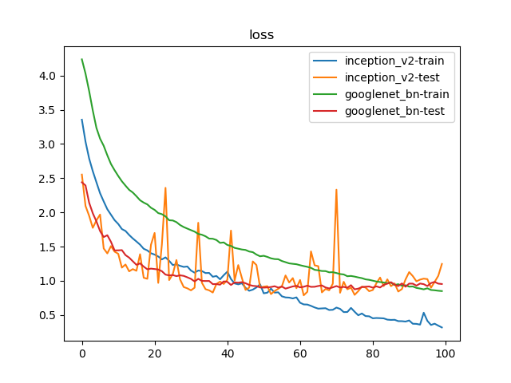
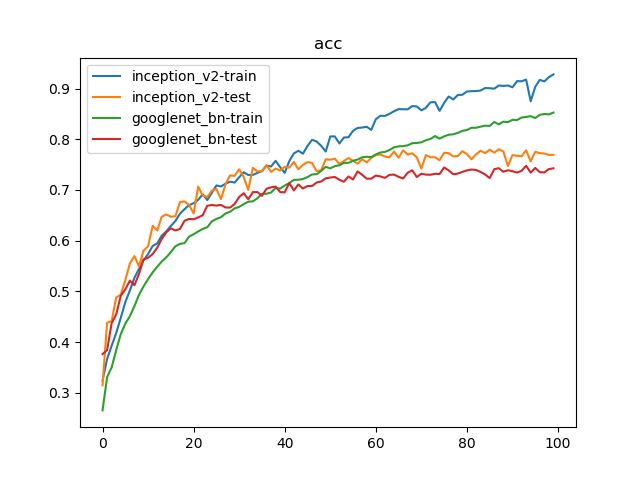

# Inception_v2 vs. GoogLeNet_BN

## 训练参数

1. 数据集：`PASCAL VOC 07+12`，`20`类共`40058`个训练样本和`12032`个测试样本
2. 批量大小：`128`
3. 优化器：`Adam`，学习率为`1e-3`
4. 随步长衰减：每隔`8`轮衰减`4%`，学习因子为`0.96`
5. 迭代次数：`100`轮

## 训练日志





```
{'train': 40058, 'test': 12032}
Epoch 0/99
----------
train Loss: 3.3556 Acc: 0.3241
test Loss: 2.5530 Acc: 0.3149
Epoch 1/99
----------
train Loss: 3.0345 Acc: 0.3666
test Loss: 2.0948 Acc: 0.4382
Epoch 2/99
----------
。。。
。。。
----------
train Loss: 0.3737 Acc: 0.9140
test Loss: 0.9842 Acc: 0.7717
Epoch 98/99
----------
train Loss: 0.3452 Acc: 0.9224
test Loss: 1.0728 Acc: 0.7690
Epoch 99/99
----------
train Loss: 0.3185 Acc: 0.9278
test Loss: 1.2475 Acc: 0.7693
Training complete in 308m 14s
Best test Acc: 0.780170
train inception_v2 done

Epoch 0/99
----------
train Loss: 4.2369 Acc: 0.2654
test Loss: 2.4403 Acc: 0.3763
Epoch 1/99
----------
train Loss: 4.0290 Acc: 0.3309
test Loss: 2.3942 Acc: 0.3842
Epoch 2/99
----------
。。。
。。。
----------
train Loss: 0.8620 Acc: 0.8497
test Loss: 0.9844 Acc: 0.7345
Epoch 98/99
----------
train Loss: 0.8552 Acc: 0.8490
test Loss: 0.9592 Acc: 0.7412
Epoch 99/99
----------
train Loss: 0.8504 Acc: 0.8526
test Loss: 0.9537 Acc: 0.7427
Training complete in 195m 12s
Best test Acc: 0.747673
train googlenet_bn done
```