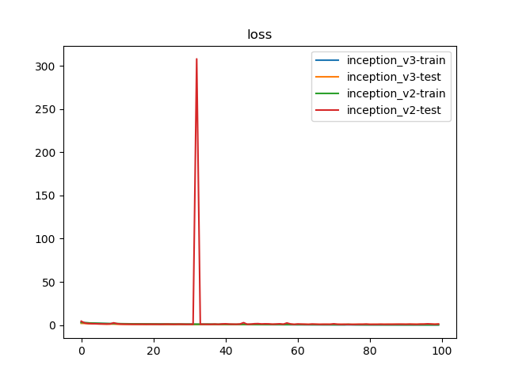
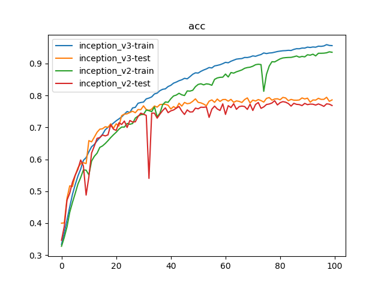

# Inception_v2 vs. Inception_v3

## 训练参数

1. 数据集：`PASCAL VOC 07+12`，`20`类共`40058`个训练样本和`12032`个测试样本
2. 批量大小：`128`
3. 损失函数：`LSR`
4. 优化器：`Adam`，学习率为`1e-3`
5. 随步长衰减：每隔`4`轮衰减`10%`，学习因子为`0.9`
6. 迭代次数：`100`轮

## 训练日志





```
$ python classifier_inception_v3.py 
{'train': <torch.utils.data.dataloader.DataLoader object at 0x7f6ca0e5ee50>, 'test': <torch.utils.data.dataloader.DataLoader object at 0x7f6ca0fd0450>}
{'train': 40058, 'test': 12032}
Epoch 0/99
----------
train Loss: 2.9042 Acc: 0.3335
test Loss: 2.0070 Acc: 0.4000
Epoch 1/99
----------
train Loss: 2.6089 Acc: 0.3695
test Loss: 1.9186 Acc: 0.4008
Epoch 2/99
----------
train Loss: 2.3796 Acc: 0.4100
test Loss: 1.6513 Acc: 0.4776
Epoch 3/99
----------
train Loss: 2.1860 Acc: 0.4510
test Loss: 1.4703 Acc: 0.5170
Epoch 4/99
----------
train Loss: 2.0039 Acc: 0.4900
test Loss: 1.4932 Acc: 0.5146
Epoch 5/99
----------
train Loss: 1.8719 Acc: 0.5205
test Loss: 1.3557 Acc: 0.5495
Epoch 6/99
----------
train Loss: 1.7542 Acc: 0.5476
test Loss: 1.2479 Acc: 0.5735
Epoch 7/99
----------
train Loss: 1.6505 Acc: 0.5691
test Loss: 1.1880 Acc: 0.5864
Epoch 8/99
----------
train Loss: 1.5618 Acc: 0.5968
test Loss: 1.1909 Acc: 0.5894
Epoch 9/99
----------
train Loss: 1.5015 Acc: 0.6054
test Loss: 1.1786 Acc: 0.5866
Epoch 10/99
----------
train Loss: 1.4384 Acc: 0.6234
test Loss: 0.9726 Acc: 0.6586
Epoch 11/99
----------
train Loss: 1.3872 Acc: 0.6395
test Loss: 1.0151 Acc: 0.6547
Epoch 12/99
----------
train Loss: 1.3450 Acc: 0.6468
test Loss: 0.9457 Acc: 0.6695
Epoch 13/99
----------
train Loss: 1.2999 Acc: 0.6579
test Loss: 0.9145 Acc: 0.6847
Epoch 14/99
----------
train Loss: 1.2607 Acc: 0.6676
test Loss: 0.8916 Acc: 0.6944
Epoch 15/99
----------
train Loss: 1.2182 Acc: 0.6783
test Loss: 0.8738 Acc: 0.6958
Epoch 16/99
----------
train Loss: 1.1705 Acc: 0.6927
test Loss: 0.8641 Acc: 0.7020
Epoch 17/99
----------
train Loss: 1.1412 Acc: 0.6999
test Loss: 0.8553 Acc: 0.7002
Epoch 18/99
----------
train Loss: 1.1140 Acc: 0.7062
test Loss: 0.8212 Acc: 0.7113
Epoch 19/99
----------
train Loss: 1.0904 Acc: 0.7136
test Loss: 0.8924 Acc: 0.6970
Epoch 20/99
----------
train Loss: 1.0644 Acc: 0.7207
test Loss: 0.8249 Acc: 0.7114
Epoch 21/99
----------
train Loss: 1.0385 Acc: 0.7267
test Loss: 0.8441 Acc: 0.7040
Epoch 22/99
----------
train Loss: 1.0048 Acc: 0.7329
test Loss: 0.7667 Acc: 0.7370
Epoch 23/99
----------
train Loss: 0.9850 Acc: 0.7414
test Loss: 0.7487 Acc: 0.7417
Epoch 24/99
----------
train Loss: 0.9478 Acc: 0.7498
test Loss: 0.7392 Acc: 0.7425
Epoch 25/99
----------
train Loss: 0.9583 Acc: 0.7467
test Loss: 0.7199 Acc: 0.7469
Epoch 26/99
----------
train Loss: 0.9106 Acc: 0.7610
test Loss: 0.7217 Acc: 0.7505
Epoch 27/99
----------
train Loss: 0.8962 Acc: 0.7628
test Loss: 0.7362 Acc: 0.7460
Epoch 28/99
----------
train Loss: 0.8553 Acc: 0.7756
test Loss: 0.7074 Acc: 0.7561
Epoch 29/99
----------
train Loss: 0.8475 Acc: 0.7780
test Loss: 0.7103 Acc: 0.7555
Epoch 30/99
----------
train Loss: 0.8292 Acc: 0.7793
test Loss: 0.6824 Acc: 0.7675
Epoch 31/99
----------
train Loss: 0.8032 Acc: 0.7893
test Loss: 0.7190 Acc: 0.7560
Epoch 32/99
----------
train Loss: 0.7861 Acc: 0.7919
test Loss: 0.7096 Acc: 0.7534
Epoch 33/99
----------
train Loss: 0.7721 Acc: 0.7956
test Loss: 0.7127 Acc: 0.7572
Epoch 34/99
----------
train Loss: 0.7460 Acc: 0.8048
test Loss: 0.6714 Acc: 0.7671
Epoch 35/99
----------
train Loss: 0.7235 Acc: 0.8074
test Loss: 0.6908 Acc: 0.7635
Epoch 36/99
----------
train Loss: 0.7050 Acc: 0.8151
test Loss: 0.6774 Acc: 0.7716
Epoch 37/99
----------
train Loss: 0.6864 Acc: 0.8193
test Loss: 0.6725 Acc: 0.7723
Epoch 38/99
----------
train Loss: 0.6817 Acc: 0.8208
test Loss: 0.6744 Acc: 0.7724
Epoch 39/99
----------
train Loss: 0.6569 Acc: 0.8280
test Loss: 0.6760 Acc: 0.7694
Epoch 40/99
----------
train Loss: 0.6357 Acc: 0.8318
test Loss: 0.7165 Acc: 0.7576
Epoch 41/99
----------
train Loss: 0.6176 Acc: 0.8387
test Loss: 0.7280 Acc: 0.7652
Epoch 42/99
----------
train Loss: 0.6041 Acc: 0.8420
test Loss: 0.7141 Acc: 0.7600
Epoch 43/99
----------
train Loss: 0.5892 Acc: 0.8462
test Loss: 0.6830 Acc: 0.7757
Epoch 44/99
----------
train Loss: 0.5746 Acc: 0.8491
test Loss: 0.7101 Acc: 0.7667
Epoch 45/99
----------
train Loss: 0.5586 Acc: 0.8538
test Loss: 0.6924 Acc: 0.7782
Epoch 46/99
----------
train Loss: 0.5711 Acc: 0.8521
test Loss: 0.6936 Acc: 0.7742
Epoch 47/99
----------
train Loss: 0.5369 Acc: 0.8590
test Loss: 0.6730 Acc: 0.7757
Epoch 48/99
----------
train Loss: 0.5122 Acc: 0.8664
test Loss: 0.6921 Acc: 0.7817
Epoch 49/99
----------
train Loss: 0.5034 Acc: 0.8709
test Loss: 0.6795 Acc: 0.7894
Epoch 50/99
----------
train Loss: 0.4973 Acc: 0.8702
test Loss: 0.6827 Acc: 0.7785
Epoch 51/99
----------
train Loss: 0.4852 Acc: 0.8757
test Loss: 0.6937 Acc: 0.7768
Epoch 52/99
----------
train Loss: 0.4695 Acc: 0.8798
test Loss: 0.7160 Acc: 0.7731
Epoch 53/99
----------
train Loss: 0.4575 Acc: 0.8831
test Loss: 0.7322 Acc: 0.7678
Epoch 54/99
----------
train Loss: 0.4438 Acc: 0.8875
test Loss: 0.7168 Acc: 0.7821
Epoch 55/99
----------
train Loss: 0.4421 Acc: 0.8862
test Loss: 0.6930 Acc: 0.7862
Epoch 56/99
----------
train Loss: 0.4184 Acc: 0.8926
test Loss: 0.7163 Acc: 0.7784
Epoch 57/99
----------
train Loss: 0.4120 Acc: 0.8943
test Loss: 0.6813 Acc: 0.7888
Epoch 58/99
----------
train Loss: 0.4045 Acc: 0.8964
test Loss: 0.7258 Acc: 0.7813
Epoch 59/99
----------
train Loss: 0.3901 Acc: 0.8997
test Loss: 0.7102 Acc: 0.7872
Epoch 60/99
----------
train Loss: 0.3792 Acc: 0.9038
test Loss: 0.6831 Acc: 0.7875
Epoch 61/99
----------
train Loss: 0.3712 Acc: 0.9024
test Loss: 0.7430 Acc: 0.7822
Epoch 62/99
----------
train Loss: 0.3689 Acc: 0.9073
test Loss: 0.7443 Acc: 0.7878
Epoch 63/99
----------
train Loss: 0.3577 Acc: 0.9106
test Loss: 0.7504 Acc: 0.7785
Epoch 64/99
----------
train Loss: 0.3438 Acc: 0.9139
test Loss: 0.7445 Acc: 0.7830
Epoch 65/99
----------
train Loss: 0.3396 Acc: 0.9149
test Loss: 0.7799 Acc: 0.7815
Epoch 66/99
----------
train Loss: 0.3326 Acc: 0.9157
test Loss: 0.7429 Acc: 0.7780
Epoch 67/99
----------
train Loss: 0.3211 Acc: 0.9191
test Loss: 0.7466 Acc: 0.7872
Epoch 68/99
----------
train Loss: 0.3258 Acc: 0.9189
test Loss: 0.7522 Acc: 0.7925
Epoch 69/99
----------
train Loss: 0.3181 Acc: 0.9207
test Loss: 0.7729 Acc: 0.7764
Epoch 70/99
----------
train Loss: 0.3082 Acc: 0.9240
test Loss: 0.7581 Acc: 0.7855
Epoch 71/99
----------
train Loss: 0.3020 Acc: 0.9227
test Loss: 0.7828 Acc: 0.7826
Epoch 72/99
----------
train Loss: 0.2954 Acc: 0.9258
test Loss: 0.7687 Acc: 0.7872
Epoch 73/99
----------
train Loss: 0.2861 Acc: 0.9283
test Loss: 0.7536 Acc: 0.7840
Epoch 74/99
----------
train Loss: 0.2740 Acc: 0.9332
test Loss: 0.8133 Acc: 0.7793
Epoch 75/99
----------
train Loss: 0.2747 Acc: 0.9313
test Loss: 0.7599 Acc: 0.7909
Epoch 76/99
----------
train Loss: 0.2648 Acc: 0.9330
test Loss: 0.7718 Acc: 0.7935
Epoch 77/99
----------
train Loss: 0.2642 Acc: 0.9337
test Loss: 0.7935 Acc: 0.7853
Epoch 78/99
----------
train Loss: 0.2551 Acc: 0.9356
test Loss: 0.7871 Acc: 0.7890
Epoch 79/99
----------
train Loss: 0.2529 Acc: 0.9377
test Loss: 0.7813 Acc: 0.7896
Epoch 80/99
----------
train Loss: 0.2442 Acc: 0.9390
test Loss: 0.7810 Acc: 0.7867
Epoch 81/99
----------
train Loss: 0.2402 Acc: 0.9401
test Loss: 0.7888 Acc: 0.7940
Epoch 82/99
----------
train Loss: 0.2417 Acc: 0.9405
test Loss: 0.7836 Acc: 0.7922
Epoch 83/99
----------
train Loss: 0.2346 Acc: 0.9415
test Loss: 0.7967 Acc: 0.7836
Epoch 84/99
----------
train Loss: 0.2334 Acc: 0.9410
test Loss: 0.8011 Acc: 0.7876
Epoch 85/99
----------
train Loss: 0.2259 Acc: 0.9443
test Loss: 0.8076 Acc: 0.7853
Epoch 86/99
----------
train Loss: 0.2216 Acc: 0.9466
test Loss: 0.8116 Acc: 0.7851
Epoch 87/99
----------
train Loss: 0.2202 Acc: 0.9464
test Loss: 0.8348 Acc: 0.7859
Epoch 88/99
----------
train Loss: 0.2119 Acc: 0.9485
test Loss: 0.8157 Acc: 0.7923
Epoch 89/99
----------
train Loss: 0.2053 Acc: 0.9484
test Loss: 0.8120 Acc: 0.7891
Epoch 90/99
----------
train Loss: 0.2071 Acc: 0.9515
test Loss: 0.8029 Acc: 0.7916
Epoch 91/99
----------
train Loss: 0.2058 Acc: 0.9503
test Loss: 0.8663 Acc: 0.7790
Epoch 92/99
----------
train Loss: 0.1996 Acc: 0.9519
test Loss: 0.8690 Acc: 0.7860
Epoch 93/99
----------
train Loss: 0.1981 Acc: 0.9512
test Loss: 0.8694 Acc: 0.7855
Epoch 94/99
----------
train Loss: 0.1871 Acc: 0.9544
test Loss: 0.8556 Acc: 0.7911
Epoch 95/99
----------
train Loss: 0.1934 Acc: 0.9539
test Loss: 0.8924 Acc: 0.7877
Epoch 96/99
----------
train Loss: 0.1847 Acc: 0.9552
test Loss: 0.8729 Acc: 0.7879
Epoch 97/99
----------
train Loss: 0.1762 Acc: 0.9593
test Loss: 0.8700 Acc: 0.7944
Epoch 98/99
----------
train Loss: 0.1778 Acc: 0.9568
test Loss: 0.9174 Acc: 0.7817
Epoch 99/99
----------
train Loss: 0.1809 Acc: 0.9562
test Loss: 0.8547 Acc: 0.7862
Training complete in 309m 25s
Best test Acc: 0.794382
train inception_v3 done

Epoch 0/99
----------
train Loss: 3.0218 Acc: 0.3277
test Loss: 4.4148 Acc: 0.3464
Epoch 1/99
----------
train Loss: 2.7195 Acc: 0.3553
test Loss: 2.2528 Acc: 0.3896
Epoch 2/99
----------
train Loss: 2.4928 Acc: 0.3883
test Loss: 1.7831 Acc: 0.4721
Epoch 3/99
----------
train Loss: 2.2758 Acc: 0.4341
test Loss: 1.5901 Acc: 0.4938
Epoch 4/99
----------
train Loss: 2.1177 Acc: 0.4649
test Loss: 1.4631 Acc: 0.5283
Epoch 5/99
----------
train Loss: 1.9898 Acc: 0.4930
test Loss: 1.3401 Acc: 0.5502
Epoch 6/99
----------
train Loss: 1.8710 Acc: 0.5224
test Loss: 1.2950 Acc: 0.5690
Epoch 7/99
----------
train Loss: 1.7740 Acc: 0.5429
test Loss: 1.1881 Acc: 0.5979
Epoch 8/99
----------
train Loss: 1.6759 Acc: 0.5666
test Loss: 1.2850 Acc: 0.5793
Epoch 9/99
----------
train Loss: 1.6897 Acc: 0.5660
test Loss: 2.5660 Acc: 0.4880
Epoch 10/99
----------
train Loss: 1.7552 Acc: 0.5514
test Loss: 1.4786 Acc: 0.5447
Epoch 11/99
----------
train Loss: 1.5684 Acc: 0.5946
test Loss: 1.1154 Acc: 0.6197
Epoch 12/99
----------
train Loss: 1.5056 Acc: 0.6094
test Loss: 1.0361 Acc: 0.6415
Epoch 13/99
----------
train Loss: 1.4543 Acc: 0.6191
test Loss: 1.0017 Acc: 0.6656
Epoch 14/99
----------
train Loss: 1.3985 Acc: 0.6373
test Loss: 0.9483 Acc: 0.6681
Epoch 15/99
----------
train Loss: 1.3732 Acc: 0.6420
test Loss: 0.9494 Acc: 0.6763
Epoch 16/99
----------
train Loss: 1.3474 Acc: 0.6495
test Loss: 0.9404 Acc: 0.6733
Epoch 17/99
----------
train Loss: 1.3086 Acc: 0.6584
test Loss: 0.9540 Acc: 0.6766
Epoch 18/99
----------
train Loss: 1.2621 Acc: 0.6682
test Loss: 0.8846 Acc: 0.7080
Epoch 19/99
----------
train Loss: 1.2423 Acc: 0.6769
test Loss: 0.9509 Acc: 0.6944
Epoch 20/99
----------
train Loss: 1.2034 Acc: 0.6848
test Loss: 0.9318 Acc: 0.6906
Epoch 21/99
----------
train Loss: 1.1728 Acc: 0.6943
test Loss: 0.9311 Acc: 0.7145
Epoch 22/99
----------
train Loss: 1.1424 Acc: 0.7010
test Loss: 0.8614 Acc: 0.7093
Epoch 23/99
----------
train Loss: 1.1497 Acc: 0.7010
test Loss: 0.9733 Acc: 0.7199
Epoch 24/99
----------
train Loss: 1.1074 Acc: 0.7124
test Loss: 1.0560 Acc: 0.6998
Epoch 25/99
----------
train Loss: 1.1116 Acc: 0.7097
test Loss: 0.8817 Acc: 0.7216
Epoch 26/99
----------
train Loss: 1.1047 Acc: 0.7122
test Loss: 0.8368 Acc: 0.7168
Epoch 27/99
----------
train Loss: 1.0379 Acc: 0.7292
test Loss: 1.0103 Acc: 0.7175
Epoch 28/99
----------
train Loss: 1.0134 Acc: 0.7354
test Loss: 0.9622 Acc: 0.7340
Epoch 29/99
----------
train Loss: 1.0025 Acc: 0.7397
test Loss: 0.8196 Acc: 0.7447
Epoch 30/99
----------
train Loss: 0.9895 Acc: 0.7408
test Loss: 0.8531 Acc: 0.7414
Epoch 31/99
----------
train Loss: 0.9474 Acc: 0.7542
test Loss: 0.8996 Acc: 0.7375
Epoch 32/99
----------
train Loss: 0.9568 Acc: 0.7525
test Loss: 308.0668 Acc: 0.5402
Epoch 33/99
----------
train Loss: 0.9549 Acc: 0.7494
test Loss: 0.9311 Acc: 0.7447
Epoch 34/99
----------
train Loss: 0.9091 Acc: 0.7642
test Loss: 0.9302 Acc: 0.7446
Epoch 35/99
----------
train Loss: 1.0267 Acc: 0.7333
test Loss: 0.8194 Acc: 0.7290
Epoch 36/99
----------
train Loss: 0.9779 Acc: 0.7443
test Loss: 0.8180 Acc: 0.7414
Epoch 37/99
----------
train Loss: 0.8928 Acc: 0.7711
test Loss: 1.0835 Acc: 0.7527
Epoch 38/99
----------
train Loss: 0.8627 Acc: 0.7797
test Loss: 0.7769 Acc: 0.7612
Epoch 39/99
----------
train Loss: 0.8520 Acc: 0.7785
test Loss: 1.2366 Acc: 0.7462
Epoch 40/99
----------
train Loss: 0.8166 Acc: 0.7898
test Loss: 1.4289 Acc: 0.7518
Epoch 41/99
----------
train Loss: 0.7822 Acc: 0.7985
test Loss: 1.0438 Acc: 0.7546
Epoch 42/99
----------
train Loss: 0.7728 Acc: 0.8013
test Loss: 0.9552 Acc: 0.7604
Epoch 43/99
----------
train Loss: 0.7529 Acc: 0.8069
test Loss: 0.9062 Acc: 0.7655
Epoch 44/99
----------
train Loss: 0.7666 Acc: 0.8020
test Loss: 1.1758 Acc: 0.7512
Epoch 45/99
----------
train Loss: 0.7720 Acc: 0.7998
test Loss: 2.7690 Acc: 0.7405
Epoch 46/99
----------
train Loss: 0.7195 Acc: 0.8142
test Loss: 0.8562 Acc: 0.7548
Epoch 47/99
----------
train Loss: 0.7223 Acc: 0.8137
test Loss: 1.0589 Acc: 0.7483
Epoch 48/99
----------
train Loss: 0.7092 Acc: 0.8162
test Loss: 1.5096 Acc: 0.7487
Epoch 49/99
----------
train Loss: 0.6768 Acc: 0.8276
test Loss: 1.6250 Acc: 0.7604
Epoch 50/99
----------
train Loss: 0.6494 Acc: 0.8346
test Loss: 1.2221 Acc: 0.7581
Epoch 51/99
----------
train Loss: 0.6375 Acc: 0.8367
test Loss: 1.4141 Acc: 0.7633
Epoch 52/99
----------
train Loss: 0.6483 Acc: 0.8333
test Loss: 1.3136 Acc: 0.7629
Epoch 53/99
----------
train Loss: 0.6418 Acc: 0.8365
test Loss: 0.9524 Acc: 0.7643
Epoch 54/99
----------
train Loss: 0.6426 Acc: 0.8354
test Loss: 1.1662 Acc: 0.7314
Epoch 55/99
----------
train Loss: 0.6590 Acc: 0.8319
test Loss: 1.4243 Acc: 0.7568
Epoch 56/99
----------
train Loss: 0.5898 Acc: 0.8504
test Loss: 0.9447 Acc: 0.7668
Epoch 57/99
----------
train Loss: 0.5723 Acc: 0.8550
test Loss: 2.3616 Acc: 0.7577
Epoch 58/99
----------
train Loss: 0.5652 Acc: 0.8568
test Loss: 1.2579 Acc: 0.7530
Epoch 59/99
----------
train Loss: 0.5634 Acc: 0.8573
test Loss: 0.7763 Acc: 0.7738
Epoch 60/99
----------
train Loss: 0.5255 Acc: 0.8671
test Loss: 1.2304 Acc: 0.7407
Epoch 61/99
----------
train Loss: 0.5519 Acc: 0.8579
test Loss: 1.0595 Acc: 0.7680
Epoch 62/99
----------
train Loss: 0.5129 Acc: 0.8719
test Loss: 0.9587 Acc: 0.7621
Epoch 63/99
----------
train Loss: 0.5148 Acc: 0.8700
test Loss: 0.7822 Acc: 0.7742
Epoch 64/99
----------
train Loss: 0.4965 Acc: 0.8742
test Loss: 1.1514 Acc: 0.7566
Epoch 65/99
----------
train Loss: 0.4866 Acc: 0.8770
test Loss: 0.9793 Acc: 0.7650
Epoch 66/99
----------
train Loss: 0.4777 Acc: 0.8801
test Loss: 0.8173 Acc: 0.7668
Epoch 67/99
----------
train Loss: 0.4611 Acc: 0.8852
test Loss: 0.9047 Acc: 0.7654
Epoch 68/99
----------
train Loss: 0.4526 Acc: 0.8875
test Loss: 0.9078 Acc: 0.7564
Epoch 69/99
----------
train Loss: 0.4469 Acc: 0.8887
test Loss: 0.8666 Acc: 0.7727
Epoch 70/99
----------
train Loss: 0.4376 Acc: 0.8917
test Loss: 1.4099 Acc: 0.7530
Epoch 71/99
----------
train Loss: 0.4194 Acc: 0.8964
test Loss: 0.8875 Acc: 0.7719
Epoch 72/99
----------
train Loss: 0.4112 Acc: 0.8978
test Loss: 0.7877 Acc: 0.7780
Epoch 73/99
----------
train Loss: 0.4164 Acc: 0.8967
test Loss: 0.8705 Acc: 0.7597
Epoch 74/99
----------
train Loss: 0.7492 Acc: 0.8130
test Loss: 0.7597 Acc: 0.7642
Epoch 75/99
----------
train Loss: 0.5266 Acc: 0.8663
test Loss: 0.7524 Acc: 0.7717
Epoch 76/99
----------
train Loss: 0.4343 Acc: 0.8921
test Loss: 0.7955 Acc: 0.7733
Epoch 77/99
----------
train Loss: 0.3882 Acc: 0.9058
test Loss: 0.9045 Acc: 0.7764
Epoch 78/99
----------
train Loss: 0.3848 Acc: 0.9052
test Loss: 0.8917 Acc: 0.7836
Epoch 79/99
----------
train Loss: 0.3687 Acc: 0.9100
test Loss: 1.0926 Acc: 0.7704
Epoch 80/99
----------
train Loss: 0.3487 Acc: 0.9147
test Loss: 0.7772 Acc: 0.7776
Epoch 81/99
----------
train Loss: 0.3440 Acc: 0.9176
test Loss: 0.8104 Acc: 0.7808
Epoch 82/99
----------
train Loss: 0.3385 Acc: 0.9185
test Loss: 0.8209 Acc: 0.7790
Epoch 83/99
----------
train Loss: 0.3341 Acc: 0.9191
test Loss: 0.9360 Acc: 0.7748
Epoch 84/99
----------
train Loss: 0.3321 Acc: 0.9193
test Loss: 0.8255 Acc: 0.7667
Epoch 85/99
----------
train Loss: 0.3208 Acc: 0.9213
test Loss: 0.8921 Acc: 0.7754
Epoch 86/99
----------
train Loss: 0.3150 Acc: 0.9237
test Loss: 0.8823 Acc: 0.7723
Epoch 87/99
----------
train Loss: 0.3269 Acc: 0.9200
test Loss: 0.9201 Acc: 0.7715
Epoch 88/99
----------
train Loss: 0.3155 Acc: 0.9224
test Loss: 0.9957 Acc: 0.7683
Epoch 89/99
----------
train Loss: 0.3185 Acc: 0.9210
test Loss: 0.9727 Acc: 0.7753
Epoch 90/99
----------
train Loss: 0.2981 Acc: 0.9276
test Loss: 0.8892 Acc: 0.7713
Epoch 91/99
----------
train Loss: 0.3026 Acc: 0.9262
test Loss: 1.0427 Acc: 0.7730
Epoch 92/99
----------
train Loss: 0.2928 Acc: 0.9294
test Loss: 0.9102 Acc: 0.7726
Epoch 93/99
----------
train Loss: 0.3115 Acc: 0.9240
test Loss: 0.8224 Acc: 0.7699
Epoch 94/99
----------
train Loss: 0.2803 Acc: 0.9323
test Loss: 1.0752 Acc: 0.7735
Epoch 95/99
----------
train Loss: 0.2797 Acc: 0.9322
test Loss: 1.0792 Acc: 0.7702
Epoch 96/99
----------
train Loss: 0.2818 Acc: 0.9325
test Loss: 1.4108 Acc: 0.7659
Epoch 97/99
----------
train Loss: 0.2697 Acc: 0.9337
test Loss: 1.1765 Acc: 0.7738
Epoch 98/99
----------
train Loss: 0.2649 Acc: 0.9368
test Loss: 0.8809 Acc: 0.7728
Epoch 99/99
----------
train Loss: 0.2668 Acc: 0.9353
test Loss: 1.2179 Acc: 0.7685
Training complete in 309m 33s
Best test Acc: 0.783577
train inception_v2 done
```